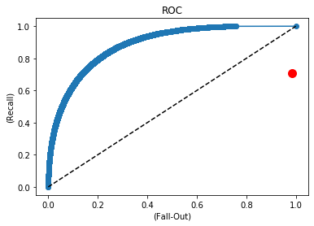

```python
import datetime, warnings, scipy 
import sklearn
import pandas as pd
import numpy as np
import pickle
from sklearn.preprocessing import LabelEncoder, OneHotEncoder
from sklearn.model_selection import train_test_split
from sklearn.linear_model import LogisticRegression
from sklearn import metrics
from sklearn.metrics import confusion_matrix
from sklearn.metrics import roc_curve
from sklearn.metrics import auc
from lightgbm import LGBMClassifier
from sklearn.metrics import accuracy_score, precision_score, recall_score, confusion_matrix
from lightgbm import plot_importance
import matplotlib.pyplot as plt
```


```python
train = pickle.load( open( "../model_feed_output/train_model.pkl", "rb" ) )
pred = pickle.load( open( "../model_feed_output/pred_model.pkl", "rb" ) )
train = train.reset_index()
pred = pred.reset_index()
```


```python
temp_year = pred['년'].copy()
temp_month = pred['월'].copy()
temp_day = pred['일'].copy()
temp_time = pred['계획'].copy()
temp_flt = pred['항공편'].copy()
```


```python
missing_train = train.isnull().sum(axis=0).reset_index()
missing_train.columns = ['variable', 'missing values']
missing_train['filling factor (%)']=(train.shape[0]-missing_train['missing values'])/train.shape[0]*100
missing_train.sort_values('filling factor (%)').reset_index(drop = True)
```


<div>
<style scoped>
    .dataframe tbody tr th:only-of-type {
        vertical-align: middle;
    }

    .dataframe tbody tr th {
        vertical-align: top;
    }

    .dataframe thead th {
        text-align: right;
    }
</style>
<table border="1" class="dataframe">
  <thead>
    <tr style="text-align: right;">
      <th></th>
      <th>variable</th>
      <th>missing values</th>
      <th>filling factor (%)</th>
    </tr>
  </thead>
  <tbody>
    <tr>
      <th>0</th>
      <td>index</td>
      <td>0</td>
      <td>100.0</td>
    </tr>
    <tr>
      <th>1</th>
      <td>CLA_4LYR_x</td>
      <td>0</td>
      <td>100.0</td>
    </tr>
    <tr>
      <th>2</th>
      <td>CLF_3LYR_x</td>
      <td>0</td>
      <td>100.0</td>
    </tr>
    <tr>
      <th>3</th>
      <td>BASE_3LYR_x</td>
      <td>0</td>
      <td>100.0</td>
    </tr>
    <tr>
      <th>4</th>
      <td>CLF_2LYR_x</td>
      <td>0</td>
      <td>100.0</td>
    </tr>
    <tr>
      <th>5</th>
      <td>BASE_2LYR_x</td>
      <td>0</td>
      <td>100.0</td>
    </tr>
    <tr>
      <th>6</th>
      <td>CLA_2LYR_x</td>
      <td>0</td>
      <td>100.0</td>
    </tr>
    <tr>
      <th>7</th>
      <td>CLF_1LYR_x</td>
      <td>0</td>
      <td>100.0</td>
    </tr>
    <tr>
      <th>8</th>
      <td>BASE_1LYR_x</td>
      <td>0</td>
      <td>100.0</td>
    </tr>
    <tr>
      <th>9</th>
      <td>CLA_1LYR_x</td>
      <td>0</td>
      <td>100.0</td>
    </tr>
    <tr>
      <th>10</th>
      <td>CA_TOT_x</td>
      <td>0</td>
      <td>100.0</td>
    </tr>
    <tr>
      <th>11</th>
      <td>HM_x</td>
      <td>0</td>
      <td>100.0</td>
    </tr>
    <tr>
      <th>12</th>
      <td>RN_x</td>
      <td>0</td>
      <td>100.0</td>
    </tr>
    <tr>
      <th>13</th>
      <td>PA_x</td>
      <td>0</td>
      <td>100.0</td>
    </tr>
    <tr>
      <th>14</th>
      <td>PS_x</td>
      <td>0</td>
      <td>100.0</td>
    </tr>
    <tr>
      <th>15</th>
      <td>TD_x</td>
      <td>0</td>
      <td>100.0</td>
    </tr>
    <tr>
      <th>16</th>
      <td>TMP_x</td>
      <td>0</td>
      <td>100.0</td>
    </tr>
    <tr>
      <th>17</th>
      <td>WC_x</td>
      <td>0</td>
      <td>100.0</td>
    </tr>
    <tr>
      <th>18</th>
      <td>RVR4_x</td>
      <td>0</td>
      <td>100.0</td>
    </tr>
    <tr>
      <th>19</th>
      <td>RVR3_x</td>
      <td>0</td>
      <td>100.0</td>
    </tr>
    <tr>
      <th>20</th>
      <td>RVR2_x</td>
      <td>0</td>
      <td>100.0</td>
    </tr>
    <tr>
      <th>21</th>
      <td>RVR1_x</td>
      <td>0</td>
      <td>100.0</td>
    </tr>
    <tr>
      <th>22</th>
      <td>VIS_x</td>
      <td>0</td>
      <td>100.0</td>
    </tr>
    <tr>
      <th>23</th>
      <td>WS_GST_x</td>
      <td>0</td>
      <td>100.0</td>
    </tr>
    <tr>
      <th>24</th>
      <td>WSPD_x</td>
      <td>0</td>
      <td>100.0</td>
    </tr>
    <tr>
      <th>25</th>
      <td>WD_x</td>
      <td>0</td>
      <td>100.0</td>
    </tr>
    <tr>
      <th>26</th>
      <td>week_of_year</td>
      <td>0</td>
      <td>100.0</td>
    </tr>
    <tr>
      <th>27</th>
      <td>day_of_year</td>
      <td>0</td>
      <td>100.0</td>
    </tr>
    <tr>
      <th>28</th>
      <td>BASE_4LYR_x</td>
      <td>0</td>
      <td>100.0</td>
    </tr>
    <tr>
      <th>29</th>
      <td>CLF_4LYR_x</td>
      <td>0</td>
      <td>100.0</td>
    </tr>
    <tr>
      <th>...</th>
      <td>...</td>
      <td>...</td>
      <td>...</td>
    </tr>
    <tr>
      <th>95</th>
      <td>mean_rain_day</td>
      <td>0</td>
      <td>100.0</td>
    </tr>
    <tr>
      <th>96</th>
      <td>mean_humid_day</td>
      <td>0</td>
      <td>100.0</td>
    </tr>
    <tr>
      <th>97</th>
      <td>mean_cloud_day</td>
      <td>0</td>
      <td>100.0</td>
    </tr>
    <tr>
      <th>98</th>
      <td>mean_speed_day</td>
      <td>0</td>
      <td>100.0</td>
    </tr>
    <tr>
      <th>99</th>
      <td>mean_temp_day</td>
      <td>0</td>
      <td>100.0</td>
    </tr>
    <tr>
      <th>100</th>
      <td>mean_pressure_day</td>
      <td>0</td>
      <td>100.0</td>
    </tr>
    <tr>
      <th>101</th>
      <td>도착편지연_x_차이</td>
      <td>0</td>
      <td>100.0</td>
    </tr>
    <tr>
      <th>102</th>
      <td>도착편미지연_x_차이</td>
      <td>0</td>
      <td>100.0</td>
    </tr>
    <tr>
      <th>103</th>
      <td>출발편지연_y_차이</td>
      <td>0</td>
      <td>100.0</td>
    </tr>
    <tr>
      <th>104</th>
      <td>출발편미지연_y_차이</td>
      <td>0</td>
      <td>100.0</td>
    </tr>
    <tr>
      <th>105</th>
      <td>도착편지연_y_차이</td>
      <td>0</td>
      <td>100.0</td>
    </tr>
    <tr>
      <th>106</th>
      <td>도착편미지연_y_차이</td>
      <td>0</td>
      <td>100.0</td>
    </tr>
    <tr>
      <th>107</th>
      <td>출발편지연_x_차이</td>
      <td>0</td>
      <td>100.0</td>
    </tr>
    <tr>
      <th>108</th>
      <td>rvr</td>
      <td>0</td>
      <td>100.0</td>
    </tr>
    <tr>
      <th>109</th>
      <td>출발편미지연_x_차이</td>
      <td>0</td>
      <td>100.0</td>
    </tr>
    <tr>
      <th>110</th>
      <td>개수(A)</td>
      <td>0</td>
      <td>100.0</td>
    </tr>
    <tr>
      <th>111</th>
      <td>지연율(D)</td>
      <td>0</td>
      <td>100.0</td>
    </tr>
    <tr>
      <th>112</th>
      <td>개수(D)</td>
      <td>0</td>
      <td>100.0</td>
    </tr>
    <tr>
      <th>113</th>
      <td>총개수</td>
      <td>0</td>
      <td>100.0</td>
    </tr>
    <tr>
      <th>114</th>
      <td>비행노선</td>
      <td>0</td>
      <td>100.0</td>
    </tr>
    <tr>
      <th>115</th>
      <td>diff_pred_y</td>
      <td>0</td>
      <td>100.0</td>
    </tr>
    <tr>
      <th>116</th>
      <td>count_pred_y</td>
      <td>0</td>
      <td>100.0</td>
    </tr>
    <tr>
      <th>117</th>
      <td>likelihood_pred_y</td>
      <td>0</td>
      <td>100.0</td>
    </tr>
    <tr>
      <th>118</th>
      <td>diff_pred_x</td>
      <td>0</td>
      <td>100.0</td>
    </tr>
    <tr>
      <th>119</th>
      <td>count_pred_x</td>
      <td>0</td>
      <td>100.0</td>
    </tr>
    <tr>
      <th>120</th>
      <td>likelihood_pred_x</td>
      <td>0</td>
      <td>100.0</td>
    </tr>
    <tr>
      <th>121</th>
      <td>count_y</td>
      <td>0</td>
      <td>100.0</td>
    </tr>
    <tr>
      <th>122</th>
      <td>diff_y</td>
      <td>0</td>
      <td>100.0</td>
    </tr>
    <tr>
      <th>123</th>
      <td>지연율(A)</td>
      <td>0</td>
      <td>100.0</td>
    </tr>
    <tr>
      <th>124</th>
      <td>schedule_mean</td>
      <td>0</td>
      <td>100.0</td>
    </tr>
  </tbody>
</table>
<p>125 rows × 3 columns</p>
</div>


```python
missing_pred = pred.isnull().sum(axis=0).reset_index()
missing_pred.columns = ['variable', 'missing values']
missing_pred['filling factor (%)']=(pred.shape[0]-missing_pred['missing values'])/pred.shape[0]*100
missing_pred.sort_values('filling factor (%)').reset_index(drop = True)
```


<div>
<style scoped>
    .dataframe tbody tr th:only-of-type {
        vertical-align: middle;
    }

    .dataframe tbody tr th {
        vertical-align: top;
    }

    .dataframe thead th {
        text-align: right;
    }
</style>
<table border="1" class="dataframe">
  <thead>
    <tr style="text-align: right;">
      <th></th>
      <th>variable</th>
      <th>missing values</th>
      <th>filling factor (%)</th>
    </tr>
  </thead>
  <tbody>
    <tr>
      <th>0</th>
      <td>schedule_mean</td>
      <td>2</td>
      <td>99.987484</td>
    </tr>
    <tr>
      <th>1</th>
      <td>schedule_count</td>
      <td>2</td>
      <td>99.987484</td>
    </tr>
    <tr>
      <th>2</th>
      <td>schedule_max</td>
      <td>2</td>
      <td>99.987484</td>
    </tr>
    <tr>
      <th>3</th>
      <td>schedule_min</td>
      <td>2</td>
      <td>99.987484</td>
    </tr>
    <tr>
      <th>4</th>
      <td>order_mean</td>
      <td>2</td>
      <td>99.987484</td>
    </tr>
    <tr>
      <th>5</th>
      <td>ORDER</td>
      <td>2</td>
      <td>99.987484</td>
    </tr>
    <tr>
      <th>6</th>
      <td>schedule</td>
      <td>1</td>
      <td>99.993742</td>
    </tr>
    <tr>
      <th>7</th>
      <td>CLA_4LYR_y</td>
      <td>0</td>
      <td>100.000000</td>
    </tr>
    <tr>
      <th>8</th>
      <td>BASE_3LYR_x</td>
      <td>0</td>
      <td>100.000000</td>
    </tr>
    <tr>
      <th>9</th>
      <td>CLF_2LYR_x</td>
      <td>0</td>
      <td>100.000000</td>
    </tr>
    <tr>
      <th>10</th>
      <td>BASE_2LYR_x</td>
      <td>0</td>
      <td>100.000000</td>
    </tr>
    <tr>
      <th>11</th>
      <td>CLA_2LYR_x</td>
      <td>0</td>
      <td>100.000000</td>
    </tr>
    <tr>
      <th>12</th>
      <td>CLF_1LYR_x</td>
      <td>0</td>
      <td>100.000000</td>
    </tr>
    <tr>
      <th>13</th>
      <td>BASE_1LYR_x</td>
      <td>0</td>
      <td>100.000000</td>
    </tr>
    <tr>
      <th>14</th>
      <td>CLA_1LYR_x</td>
      <td>0</td>
      <td>100.000000</td>
    </tr>
    <tr>
      <th>15</th>
      <td>CA_TOT_x</td>
      <td>0</td>
      <td>100.000000</td>
    </tr>
    <tr>
      <th>16</th>
      <td>HM_x</td>
      <td>0</td>
      <td>100.000000</td>
    </tr>
    <tr>
      <th>17</th>
      <td>RN_x</td>
      <td>0</td>
      <td>100.000000</td>
    </tr>
    <tr>
      <th>18</th>
      <td>PA_x</td>
      <td>0</td>
      <td>100.000000</td>
    </tr>
    <tr>
      <th>19</th>
      <td>PS_x</td>
      <td>0</td>
      <td>100.000000</td>
    </tr>
    <tr>
      <th>20</th>
      <td>TD_x</td>
      <td>0</td>
      <td>100.000000</td>
    </tr>
    <tr>
      <th>21</th>
      <td>TMP_x</td>
      <td>0</td>
      <td>100.000000</td>
    </tr>
    <tr>
      <th>22</th>
      <td>WC_x</td>
      <td>0</td>
      <td>100.000000</td>
    </tr>
    <tr>
      <th>23</th>
      <td>RVR4_x</td>
      <td>0</td>
      <td>100.000000</td>
    </tr>
    <tr>
      <th>24</th>
      <td>RVR3_x</td>
      <td>0</td>
      <td>100.000000</td>
    </tr>
    <tr>
      <th>25</th>
      <td>RVR2_x</td>
      <td>0</td>
      <td>100.000000</td>
    </tr>
    <tr>
      <th>26</th>
      <td>RVR1_x</td>
      <td>0</td>
      <td>100.000000</td>
    </tr>
    <tr>
      <th>27</th>
      <td>VIS_x</td>
      <td>0</td>
      <td>100.000000</td>
    </tr>
    <tr>
      <th>28</th>
      <td>WS_GST_x</td>
      <td>0</td>
      <td>100.000000</td>
    </tr>
    <tr>
      <th>29</th>
      <td>WSPD_x</td>
      <td>0</td>
      <td>100.000000</td>
    </tr>
    <tr>
      <th>...</th>
      <td>...</td>
      <td>...</td>
      <td>...</td>
    </tr>
    <tr>
      <th>90</th>
      <td>count_y</td>
      <td>0</td>
      <td>100.000000</td>
    </tr>
    <tr>
      <th>91</th>
      <td>count_pred_x</td>
      <td>0</td>
      <td>100.000000</td>
    </tr>
    <tr>
      <th>92</th>
      <td>rvr</td>
      <td>0</td>
      <td>100.000000</td>
    </tr>
    <tr>
      <th>93</th>
      <td>visibillity</td>
      <td>0</td>
      <td>100.000000</td>
    </tr>
    <tr>
      <th>94</th>
      <td>mean_rain_day</td>
      <td>0</td>
      <td>100.000000</td>
    </tr>
    <tr>
      <th>95</th>
      <td>mean_humid_day</td>
      <td>0</td>
      <td>100.000000</td>
    </tr>
    <tr>
      <th>96</th>
      <td>mean_cloud_day</td>
      <td>0</td>
      <td>100.000000</td>
    </tr>
    <tr>
      <th>97</th>
      <td>mean_speed_day</td>
      <td>0</td>
      <td>100.000000</td>
    </tr>
    <tr>
      <th>98</th>
      <td>mean_temp_day</td>
      <td>0</td>
      <td>100.000000</td>
    </tr>
    <tr>
      <th>99</th>
      <td>mean_pressure_day</td>
      <td>0</td>
      <td>100.000000</td>
    </tr>
    <tr>
      <th>100</th>
      <td>도착편지연_x_차이</td>
      <td>0</td>
      <td>100.000000</td>
    </tr>
    <tr>
      <th>101</th>
      <td>도착편미지연_x_차이</td>
      <td>0</td>
      <td>100.000000</td>
    </tr>
    <tr>
      <th>102</th>
      <td>출발편지연_y_차이</td>
      <td>0</td>
      <td>100.000000</td>
    </tr>
    <tr>
      <th>103</th>
      <td>출발편미지연_y_차이</td>
      <td>0</td>
      <td>100.000000</td>
    </tr>
    <tr>
      <th>104</th>
      <td>likelihood_pred_x</td>
      <td>0</td>
      <td>100.000000</td>
    </tr>
    <tr>
      <th>105</th>
      <td>도착편지연_y_차이</td>
      <td>0</td>
      <td>100.000000</td>
    </tr>
    <tr>
      <th>106</th>
      <td>출발편지연_x_차이</td>
      <td>0</td>
      <td>100.000000</td>
    </tr>
    <tr>
      <th>107</th>
      <td>출발편미지연_x_차이</td>
      <td>0</td>
      <td>100.000000</td>
    </tr>
    <tr>
      <th>108</th>
      <td>지연율(A)</td>
      <td>0</td>
      <td>100.000000</td>
    </tr>
    <tr>
      <th>109</th>
      <td>개수(A)</td>
      <td>0</td>
      <td>100.000000</td>
    </tr>
    <tr>
      <th>110</th>
      <td>지연율(D)</td>
      <td>0</td>
      <td>100.000000</td>
    </tr>
    <tr>
      <th>111</th>
      <td>개수(D)</td>
      <td>0</td>
      <td>100.000000</td>
    </tr>
    <tr>
      <th>112</th>
      <td>총개수</td>
      <td>0</td>
      <td>100.000000</td>
    </tr>
    <tr>
      <th>113</th>
      <td>비행노선</td>
      <td>0</td>
      <td>100.000000</td>
    </tr>
    <tr>
      <th>114</th>
      <td>diff_pred_y</td>
      <td>0</td>
      <td>100.000000</td>
    </tr>
    <tr>
      <th>115</th>
      <td>count_pred_y</td>
      <td>0</td>
      <td>100.000000</td>
    </tr>
    <tr>
      <th>116</th>
      <td>likelihood_pred_y</td>
      <td>0</td>
      <td>100.000000</td>
    </tr>
    <tr>
      <th>117</th>
      <td>diff_pred_x</td>
      <td>0</td>
      <td>100.000000</td>
    </tr>
    <tr>
      <th>118</th>
      <td>도착편미지연_y_차이</td>
      <td>0</td>
      <td>100.000000</td>
    </tr>
    <tr>
      <th>119</th>
      <td>day_of_year</td>
      <td>0</td>
      <td>100.000000</td>
    </tr>
  </tbody>
</table>
<p>120 rows × 3 columns</p>
</div>


```python
pred['schedule_mean'] = pred['schedule_mean'].fillna(0)
pred['schedule_count'] = pred['schedule_count'].fillna(0)
pred['schedule_max'] = pred['schedule_max'].fillna(0)
pred['schedule_min'] = pred['schedule_min'].fillna(0)
pred['order_mean'] = pred['order_mean'].fillna(0)
pred['ORDER'] = pred['ORDER'].fillna(0)
pred['schedule'] = pred['schedule'].fillna(0)
```


```python
train['계획'] = train['계획'].apply(lambda x : 60 * float(x.split(':')[0]) + float(x.split(':')[1]))
pred['계획'] = pred['계획'].apply(lambda x : 60 * float(x.split(':')[0]) + float(x.split(':')[1]))
train['ORDER'] = train['ORDER'].apply(lambda x : int(x))
pred['ORDER'] = pred['ORDER'].apply(lambda x : int(x))
```


```python
th = 3
idx = train[train['schedule_count'] < th]['schedule_min'].index
train['schedule_min'].loc[idx] = 0
train['schedule_max'].loc[idx] = 0
train['schedule_mean'].loc[idx] = 0
train['schedule_count'].loc[idx] = 0
train['schedule'].loc[idx] = 0

idx = pred[pred['schedule'] == -1].index
pred['schedule_min'].loc[idx] = 0
pred['schedule_max'].loc[idx] = 0
pred['schedule_mean'].loc[idx] = 0
pred['schedule_count'].loc[idx] = 0
pred['schedule'].loc[idx] = 0
```


```python
train['schedule'] = train['schedule'].apply(lambda x : int(x))
pred['schedule'] = pred['schedule'].apply(lambda x : int(x))
```


```python
for i in train.columns:
    ok = False
    for j in pred.columns:
        if i == j:
            ok = True
    if ok == False:
        print(i)
```

    식별번호
    실제
    지연사유
    결항
    결항사유
    부정기편


```python
variables_to_remove = ['airlines_classified','비행노선','wind_shear','day_of_year','결항사유','요일','항공편','식별번호','지연사유','부정기편','년','월','일','실제','결항']
train.drop(variables_to_remove, axis = 1, inplace = True)
```


```python
for i in pred.columns:
    ok = False
    for j in train.columns:
        if i == j:
            ok = True
    if ok == False:
        print(i)
```

    년
    월
    일
    요일
    항공편
    지연확률
    airlines_classified
    비행노선
    wind_shear
    day_of_year


```python
variables_to_remove = ['airlines_classified','지연확률','비행노선','wind_shear','day_of_year','요일','항공편','년','월','일']
pred.drop(variables_to_remove, axis = 1, inplace = True)
```


```python
for i in pred.columns:
    if type(pred[i][0]) != type(train[i][0]):
        print(i)
```

    지연


```python
len(pred)
```


    15980


```python
train.columns[101:]
```


    Index(['CLA_4LYR_y', 'BASE_4LYR_y', 'ORDER', 'order_mean', 'schedule',
           'schedule_min', 'schedule_max', 'schedule_count', 'schedule_mean'],
          dtype='object')


```python
train['schedule'] = train['schedule'].apply(lambda x : int(x))
variables_to_remove = ['지연']
x = train.drop(variables_to_remove, axis = 1)
pred = pred.drop(variables_to_remove, axis = 1)
y = train['지연']
```


```python
cols = x.columns
col_name_list = []
name_list = ['절편']
start_point = 1
end_point = 0
i = 0
X = np.ones((len(x),1))
X_pred = np.ones((len(pred),1))

for col in cols:
    print(i, col)
    i = i + 1
    start_point = end_point + 1
    if(type(x.loc[0][col]) == str):
        label_encoder = LabelEncoder()
        integer_encoded = label_encoder.fit_transform(x[col])
        zipped = zip(integer_encoded, x[col])
        label = list(set(list(zipped)))
        for i in range(len(label)):
            name_list.append(label[i][1])
        end_point = start_point + len(set(integer_encoded)) - 1
        
        values = set(x[col].unique()) | set(pred[col].unique())
        values = list(values)
        x_temp = np.zeros((len(x), len(values)))
        x_pred_temp = np.zeros((len(pred), len(values)))
        temp_col = 0
        for value in values:
            idx1 = x[x[col] == value].index
            x_temp[idx1, temp_col] = 1
    
            idx2 = pred[pred[col] == value].index
            x_pred_temp[idx2, temp_col] = 1
            temp_col = temp_col + 1
        X = np.hstack((X,x_temp))
        X_pred = np.hstack((X_pred,x_pred_temp))
    else:
        X = np.hstack((X,np.array(x[col]).reshape(len(x),-1)))
        X_pred = np.hstack((X_pred,np.array(pred[col]).reshape(len(pred),-1)))
        col_name_list.append([start_point, start_point])
        end_point += 1
        name_list.append(col)
print(name_list)
Y = y.apply(lambda x : 1 if x == 'Y' else 0)
```

    0 index
    1 공항
    12 출도착
    1 상대공항
    14 항공사
    6 계획
    7 departure_time
    18 flo_del_start_x
    19 계획시간별_평균지연시간
    20 flo_del_start_y
    21 flo_del_finish
    22 flo_del_all
    23 출발지연만_항공사별지연시간평균
    24 도착지연만_항공사별지연시간평균
    25 출발_항공사별지연시간평균
    26 도착_항공사별지연시간평균
    27 likelihood_x
    28 count_x
    29 likelihood_y
    30 diff_y
    31 count_y
    32 likelihood_pred_x
    33 count_pred_x
    34 diff_pred_x
    35 likelihood_pred_y
    36 count_pred_y
    37 diff_pred_y
    38 총개수
    39 개수(D)
    40 지연율(D)
    41 개수(A)
    42 지연율(A)
    43 출발편미지연_x_차이
    44 출발편지연_x_차이
    45 도착편미지연_y_차이
    46 도착편지연_y_차이
    47 출발편미지연_y_차이
    48 출발편지연_y_차이
    49 도착편미지연_x_차이
    50 도착편지연_x_차이
    51 mean_pressure_day
    52 mean_temp_day
    53 mean_speed_day
    54 mean_cloud_day
    55 mean_humid_day
    56 mean_rain_day
    57 visibillity
    58 rvr
    59 lowest_cloud
    60 week_of_year
    61 WD_x
    62 WSPD_x
    63 WS_GST_x
    64 VIS_x
    65 RVR1_x
    66 RVR2_x
    67 RVR3_x
    68 RVR4_x
    69 WC_x
    70 TMP_x
    71 TD_x
    72 PS_x
    73 PA_x
    74 RN_x
    75 HM_x
    76 CA_TOT_x
    77 CLA_1LYR_x
    78 BASE_1LYR_x
    79 CLF_1LYR_x
    80 CLA_2LYR_x
    81 BASE_2LYR_x
    82 CLF_2LYR_x
    83 BASE_3LYR_x
    84 CLF_3LYR_x
    85 CLA_4LYR_x
    86 BASE_4LYR_x
    87 CLF_4LYR_x
    88 WD_y
    89 WSPD_y
    90 WS_GST_y
    91 VIS_y
    92 RVR1_y
    93 RVR2_y
    94 RVR4_y
    95 WC_y
    96 TMP_y
    97 TD_y
    98 PS_y
    99 PA_y
    100 RN_y
    101 HM_y
    102 CA_TOT_y
    103 CLA_1LYR_y
    104 BASE_1LYR_y
    105 CLF_1LYR_y
    106 CLA_2LYR_y
    107 BASE_2LYR_y
    108 CLF_2LYR_y
    109 BASE_3LYR_y
    110 CLF_3LYR_y
    111 CLA_4LYR_y
    112 BASE_4LYR_y
    113 ORDER
    114 order_mean
    115 schedule
    116 schedule_min
    117 schedule_max
    118 schedule_count
    119 schedule_mean
    ['절편', 'index', '인천', '무안', '김포', '사천', '청주', '양양', '울산', '광주', '대구', '제주', '여수', '포항', '김해', '도착', '출발', '김해', '제주', '군산', '포항', '광주', '울산', '청주', '양양', '인천', '여수', '김포', '원주', '무안', '사천', '대구', '대한항공', '제주항공', '에어부산', '진에어', '이스타', '아시아나', '티웨이', '계획', '20', '21', '17', '16', '11', '10', '12', '09', '06', '14', '13', '19', '08', '00', '05', '15', '22', '07', '18', 'flo_del_start_x', '계획시간별_평균지연시간', 'flo_del_start_y', 'flo_del_finish', 'flo_del_all', '출발지연만_항공사별지연시간평균', '도착지연만_항공사별지연시간평균', '출발_항공사별지연시간평균', '도착_항공사별지연시간평균', 'likelihood_x', 'count_x', 'likelihood_y', 'diff_y', 'count_y', 'likelihood_pred_x', 'count_pred_x', 'diff_pred_x', 'likelihood_pred_y', 'count_pred_y', 'diff_pred_y', '총개수', '개수(D)', '지연율(D)', '개수(A)', '지연율(A)', '출발편미지연_x_차이', '출발편지연_x_차이', '도착편미지연_y_차이', '도착편지연_y_차이', '출발편미지연_y_차이', '출발편지연_y_차이', '도착편미지연_x_차이', '도착편지연_x_차이', 'mean_pressure_day', 'mean_temp_day', 'mean_speed_day', 'mean_cloud_day', 'mean_humid_day', 'mean_rain_day', 'visibillity', 'rvr', 'lowest_cloud', 'week_of_year', 'WD_x', 'WSPD_x', 'WS_GST_x', 'VIS_x', 'RVR1_x', 'RVR2_x', 'RVR3_x', 'RVR4_x', 'WC_x', 'TMP_x', 'TD_x', 'PS_x', 'PA_x', 'RN_x', 'HM_x', 'CA_TOT_x', 'CLA_1LYR_x', 'BASE_1LYR_x', 'CLF_1LYR_x', 'CLA_2LYR_x', 'BASE_2LYR_x', 'CLF_2LYR_x', 'BASE_3LYR_x', 'CLF_3LYR_x', 'CLA_4LYR_x', 'BASE_4LYR_x', 'CLF_4LYR_x', 'WD_y', 'WSPD_y', 'WS_GST_y', 'VIS_y', 'RVR1_y', 'RVR2_y', 'RVR4_y', 'WC_y', 'TMP_y', 'TD_y', 'PS_y', 'PA_y', 'RN_y', 'HM_y', 'CA_TOT_y', 'CLA_1LYR_y', 'BASE_1LYR_y', 'CLF_1LYR_y', 'CLA_2LYR_y', 'BASE_2LYR_y', 'CLF_2LYR_y', 'BASE_3LYR_y', 'CLF_3LYR_y', 'CLA_4LYR_y', 'BASE_4LYR_y', 'ORDER', 'order_mean', 'schedule', 'schedule_min', 'schedule_max', 'schedule_count', 'schedule_mean']


```python
def get_clf_eval(y_test, pred):
    confusion = confusion_matrix(y_test, pred)
    accuracy = accuracy_score(y_test, pred)
    precision = precision_score(y_test, pred)
    recall = recall_score(y_test, pred)
    print('오차 행렬')
    print(confusion)
    print('정확도: {0:.4f}, 정밀도: {1:.4f}, 재현율: {2:.4f}'.format(accuracy, precision, recall))
    return confusion
```


```python
X_train_gbm , X_test_gbm, y_train_gbm, y_test_gbm = train_test_split(X, Y, test_size = 0.3, random_state  = 156)

lgbm_wrapper = LGBMClassifier(n_estimators = 1000, learning_rate = 0.05 ,lambda_l1 = 0.1)

evals = [(X_test_gbm, y_test_gbm)]
lgbm_wrapper.fit(X_train_gbm, y_train_gbm, early_stopping_rounds = 100, eval_metric = "logloss",
                 eval_set = evals, verbose = True)
preds_gbm = lgbm_wrapper.predict(X_test_gbm)
preds_gbm_ = lgbm_wrapper.predict_proba(X_test_gbm)
```

    [1]	valid_0's binary_logloss: 0.362025	valid_0's binary_logloss: 0.362025
    Training until validation scores don't improve for 100 rounds.
    [2]	valid_0's binary_logloss: 0.35434	valid_0's binary_logloss: 0.35434
    [3]	valid_0's binary_logloss: 0.347807	valid_0's binary_logloss: 0.347807
    [4]	valid_0's binary_logloss: 0.342133	valid_0's binary_logloss: 0.342133
    [5]	valid_0's binary_logloss: 0.336942	valid_0's binary_logloss: 0.336942
    [6]	valid_0's binary_logloss: 0.332339	valid_0's binary_logloss: 0.332339
    [7]	valid_0's binary_logloss: 0.328229	valid_0's binary_logloss: 0.328229
    [8]	valid_0's binary_logloss: 0.324551	valid_0's binary_logloss: 0.324551
    [9]	valid_0's binary_logloss: 0.321165	valid_0's binary_logloss: 0.321165
    [10]	valid_0's binary_logloss: 0.318111	valid_0's binary_logloss: 0.318111
    [11]	valid_0's binary_logloss: 0.315287	valid_0's binary_logloss: 0.315287
    [12]	valid_0's binary_logloss: 0.312646	valid_0's binary_logloss: 0.312646
    [13]	valid_0's binary_logloss: 0.310262	valid_0's binary_logloss: 0.310262
    [14]	valid_0's binary_logloss: 0.30807	valid_0's binary_logloss: 0.30807
    [15]	valid_0's binary_logloss: 0.305955	valid_0's binary_logloss: 0.305955
    [16]	valid_0's binary_logloss: 0.304093	valid_0's binary_logloss: 0.304093
    [17]	valid_0's binary_logloss: 0.302329	valid_0's binary_logloss: 0.302329
    [18]	valid_0's binary_logloss: 0.300677	valid_0's binary_logloss: 0.300677
    [19]	valid_0's binary_logloss: 0.299127	valid_0's binary_logloss: 0.299127
    [20]	valid_0's binary_logloss: 0.297623	valid_0's binary_logloss: 0.297623
    [21]	valid_0's binary_logloss: 0.296275	valid_0's binary_logloss: 0.296275
    [22]	valid_0's binary_logloss: 0.294964	valid_0's binary_logloss: 0.294964
    [23]	valid_0's binary_logloss: 0.293781	valid_0's binary_logloss: 0.293781
    [24]	valid_0's binary_logloss: 0.292616	valid_0's binary_logloss: 0.292616
    [25]	valid_0's binary_logloss: 0.291584	valid_0's binary_logloss: 0.291584
    [26]	valid_0's binary_logloss: 0.290567	valid_0's binary_logloss: 0.290567
    [27]	valid_0's binary_logloss: 0.28963	valid_0's binary_logloss: 0.28963
    [28]	valid_0's binary_logloss: 0.288678	valid_0's binary_logloss: 0.288678
    [29]	valid_0's binary_logloss: 0.287812	valid_0's binary_logloss: 0.287812
    [30]	valid_0's binary_logloss: 0.286948	valid_0's binary_logloss: 0.286948
    [31]	valid_0's binary_logloss: 0.286151	valid_0's binary_logloss: 0.286151
    [32]	valid_0's binary_logloss: 0.285424	valid_0's binary_logloss: 0.285424
    [33]	valid_0's binary_logloss: 0.284737	valid_0's binary_logloss: 0.284737
    [34]	valid_0's binary_logloss: 0.284086	valid_0's binary_logloss: 0.284086
    [35]	valid_0's binary_logloss: 0.283455	valid_0's binary_logloss: 0.283455
    [36]	valid_0's binary_logloss: 0.282859	valid_0's binary_logloss: 0.282859
    [37]	valid_0's binary_logloss: 0.282264	valid_0's binary_logloss: 0.282264
    [38]	valid_0's binary_logloss: 0.281716	valid_0's binary_logloss: 0.281716
    [39]	valid_0's binary_logloss: 0.281204	valid_0's binary_logloss: 0.281204
    [40]	valid_0's binary_logloss: 0.280694	valid_0's binary_logloss: 0.280694
    [41]	valid_0's binary_logloss: 0.280188	valid_0's binary_logloss: 0.280188
    [42]	valid_0's binary_logloss: 0.279716	valid_0's binary_logloss: 0.279716
    [43]	valid_0's binary_logloss: 0.279216	valid_0's binary_logloss: 0.279216
    [44]	valid_0's binary_logloss: 0.27877	valid_0's binary_logloss: 0.27877
    [45]	valid_0's binary_logloss: 0.278335	valid_0's binary_logloss: 0.278335
    [46]	valid_0's binary_logloss: 0.277879	valid_0's binary_logloss: 0.277879
    [47]	valid_0's binary_logloss: 0.2775	valid_0's binary_logloss: 0.2775
    [48]	valid_0's binary_logloss: 0.277131	valid_0's binary_logloss: 0.277131
    [49]	valid_0's binary_logloss: 0.276747	valid_0's binary_logloss: 0.276747
    [50]	valid_0's binary_logloss: 0.276394	valid_0's binary_logloss: 0.276394
    [51]	valid_0's binary_logloss: 0.27602	valid_0's binary_logloss: 0.27602
    [52]	valid_0's binary_logloss: 0.275721	valid_0's binary_logloss: 0.275721
    [53]	valid_0's binary_logloss: 0.275338	valid_0's binary_logloss: 0.275338
    [54]	valid_0's binary_logloss: 0.274949	valid_0's binary_logloss: 0.274949
    [55]	valid_0's binary_logloss: 0.274602	valid_0's binary_logloss: 0.274602
    [56]	valid_0's binary_logloss: 0.274307	valid_0's binary_logloss: 0.274307
    [57]	valid_0's binary_logloss: 0.273988	valid_0's binary_logloss: 0.273988
    [58]	valid_0's binary_logloss: 0.273685	valid_0's binary_logloss: 0.273685
    [59]	valid_0's binary_logloss: 0.273452	valid_0's binary_logloss: 0.273452
    [60]	valid_0's binary_logloss: 0.273167	valid_0's binary_logloss: 0.273167
    [61]	valid_0's binary_logloss: 0.272915	valid_0's binary_logloss: 0.272915
    [62]	valid_0's binary_logloss: 0.272699	valid_0's binary_logloss: 0.272699
    [63]	valid_0's binary_logloss: 0.272416	valid_0's binary_logloss: 0.272416
    [64]	valid_0's binary_logloss: 0.272145	valid_0's binary_logloss: 0.272145
    [65]	valid_0's binary_logloss: 0.271926	valid_0's binary_logloss: 0.271926
    [66]	valid_0's binary_logloss: 0.27166	valid_0's binary_logloss: 0.27166
    [67]	valid_0's binary_logloss: 0.271409	valid_0's binary_logloss: 0.271409
    [68]	valid_0's binary_logloss: 0.271153	valid_0's binary_logloss: 0.271153
    [69]	valid_0's binary_logloss: 0.2709	valid_0's binary_logloss: 0.2709
    [70]	valid_0's binary_logloss: 0.270688	valid_0's binary_logloss: 0.270688
    [71]	valid_0's binary_logloss: 0.270514	valid_0's binary_logloss: 0.270514
    [72]	valid_0's binary_logloss: 0.270302	valid_0's binary_logloss: 0.270302
    [73]	valid_0's binary_logloss: 0.270073	valid_0's binary_logloss: 0.270073
    [74]	valid_0's binary_logloss: 0.269922	valid_0's binary_logloss: 0.269922
    [75]	valid_0's binary_logloss: 0.269651	valid_0's binary_logloss: 0.269651
    [76]	valid_0's binary_logloss: 0.269462	valid_0's binary_logloss: 0.269462
    [77]	valid_0's binary_logloss: 0.269291	valid_0's binary_logloss: 0.269291
    [78]	valid_0's binary_logloss: 0.269053	valid_0's binary_logloss: 0.269053
    [79]	valid_0's binary_logloss: 0.268834	valid_0's binary_logloss: 0.268834
    [80]	valid_0's binary_logloss: 0.268667	valid_0's binary_logloss: 0.268667
    [81]	valid_0's binary_logloss: 0.268477	valid_0's binary_logloss: 0.268477
    [82]	valid_0's binary_logloss: 0.268282	valid_0's binary_logloss: 0.268282
    [83]	valid_0's binary_logloss: 0.26814	valid_0's binary_logloss: 0.26814
    [84]	valid_0's binary_logloss: 0.267913	valid_0's binary_logloss: 0.267913
    [85]	valid_0's binary_logloss: 0.267775	valid_0's binary_logloss: 0.267775
    [86]	valid_0's binary_logloss: 0.26764	valid_0's binary_logloss: 0.26764
    [87]	valid_0's binary_logloss: 0.267428	valid_0's binary_logloss: 0.267428
    [88]	valid_0's binary_logloss: 0.267255	valid_0's binary_logloss: 0.267255
    [89]	valid_0's binary_logloss: 0.267115	valid_0's binary_logloss: 0.267115
    [90]	valid_0's binary_logloss: 0.266982	valid_0's binary_logloss: 0.266982
    [91]	valid_0's binary_logloss: 0.266811	valid_0's binary_logloss: 0.266811
    [92]	valid_0's binary_logloss: 0.266644	valid_0's binary_logloss: 0.266644
    [93]	valid_0's binary_logloss: 0.266529	valid_0's binary_logloss: 0.266529
    [94]	valid_0's binary_logloss: 0.266384	valid_0's binary_logloss: 0.266384
    [95]	valid_0's binary_logloss: 0.266236	valid_0's binary_logloss: 0.266236
    [96]	valid_0's binary_logloss: 0.266089	valid_0's binary_logloss: 0.266089
    [97]	valid_0's binary_logloss: 0.265975	valid_0's binary_logloss: 0.265975
    [98]	valid_0's binary_logloss: 0.265821	valid_0's binary_logloss: 0.265821
    [99]	valid_0's binary_logloss: 0.2657	valid_0's binary_logloss: 0.2657
    [100]	valid_0's binary_logloss: 0.265612	valid_0's binary_logloss: 0.265612
    [101]	valid_0's binary_logloss: 0.265438	valid_0's binary_logloss: 0.265438
    [102]	valid_0's binary_logloss: 0.26529	valid_0's binary_logloss: 0.26529
    [103]	valid_0's binary_logloss: 0.265165	valid_0's binary_logloss: 0.265165
    [104]	valid_0's binary_logloss: 0.265022	valid_0's binary_logloss: 0.265022
    [105]	valid_0's binary_logloss: 0.264874	valid_0's binary_logloss: 0.264874
    [106]	valid_0's binary_logloss: 0.264742	valid_0's binary_logloss: 0.264742
    [107]	valid_0's binary_logloss: 0.26461	valid_0's binary_logloss: 0.26461
    [108]	valid_0's binary_logloss: 0.264463	valid_0's binary_logloss: 0.264463
    [109]	valid_0's binary_logloss: 0.264361	valid_0's binary_logloss: 0.264361
    [110]	valid_0's binary_logloss: 0.264248	valid_0's binary_logloss: 0.264248
    [111]	valid_0's binary_logloss: 0.264121	valid_0's binary_logloss: 0.264121
    [112]	valid_0's binary_logloss: 0.263995	valid_0's binary_logloss: 0.263995
    [113]	valid_0's binary_logloss: 0.263861	valid_0's binary_logloss: 0.263861
    [114]	valid_0's binary_logloss: 0.26374	valid_0's binary_logloss: 0.26374
    [115]	valid_0's binary_logloss: 0.263653	valid_0's binary_logloss: 0.263653
    [116]	valid_0's binary_logloss: 0.263535	valid_0's binary_logloss: 0.263535
    [117]	valid_0's binary_logloss: 0.263399	valid_0's binary_logloss: 0.263399
    [118]	valid_0's binary_logloss: 0.263296	valid_0's binary_logloss: 0.263296
    [119]	valid_0's binary_logloss: 0.263228	valid_0's binary_logloss: 0.263228
    [120]	valid_0's binary_logloss: 0.263109	valid_0's binary_logloss: 0.263109
    [121]	valid_0's binary_logloss: 0.263013	valid_0's binary_logloss: 0.263013
    [122]	valid_0's binary_logloss: 0.262914	valid_0's binary_logloss: 0.262914
    [123]	valid_0's binary_logloss: 0.262835	valid_0's binary_logloss: 0.262835
    [124]	valid_0's binary_logloss: 0.262744	valid_0's binary_logloss: 0.262744
    [125]	valid_0's binary_logloss: 0.26264	valid_0's binary_logloss: 0.26264
    [126]	valid_0's binary_logloss: 0.262521	valid_0's binary_logloss: 0.262521
    [127]	valid_0's binary_logloss: 0.262432	valid_0's binary_logloss: 0.262432
    [128]	valid_0's binary_logloss: 0.26234	valid_0's binary_logloss: 0.26234
    [129]	valid_0's binary_logloss: 0.262267	valid_0's binary_logloss: 0.262267
    [130]	valid_0's binary_logloss: 0.262155	valid_0's binary_logloss: 0.262155
    [131]	valid_0's binary_logloss: 0.262044	valid_0's binary_logloss: 0.262044
    [132]	valid_0's binary_logloss: 0.261909	valid_0's binary_logloss: 0.261909
    [133]	valid_0's binary_logloss: 0.261821	valid_0's binary_logloss: 0.261821
    [134]	valid_0's binary_logloss: 0.261745	valid_0's binary_logloss: 0.261745
    [135]	valid_0's binary_logloss: 0.26165	valid_0's binary_logloss: 0.26165
    [136]	valid_0's binary_logloss: 0.261596	valid_0's binary_logloss: 0.261596
    [137]	valid_0's binary_logloss: 0.261497	valid_0's binary_logloss: 0.261497
    [138]	valid_0's binary_logloss: 0.261391	valid_0's binary_logloss: 0.261391
    [139]	valid_0's binary_logloss: 0.261307	valid_0's binary_logloss: 0.261307
    [140]	valid_0's binary_logloss: 0.261229	valid_0's binary_logloss: 0.261229
    [141]	valid_0's binary_logloss: 0.261124	valid_0's binary_logloss: 0.261124
    [142]	valid_0's binary_logloss: 0.261029	valid_0's binary_logloss: 0.261029
    [143]	valid_0's binary_logloss: 0.26096	valid_0's binary_logloss: 0.26096
    [144]	valid_0's binary_logloss: 0.260862	valid_0's binary_logloss: 0.260862
    [145]	valid_0's binary_logloss: 0.260789	valid_0's binary_logloss: 0.260789
    [146]	valid_0's binary_logloss: 0.260717	valid_0's binary_logloss: 0.260717
    [147]	valid_0's binary_logloss: 0.260607	valid_0's binary_logloss: 0.260607
    [148]	valid_0's binary_logloss: 0.26052	valid_0's binary_logloss: 0.26052
    [149]	valid_0's binary_logloss: 0.260412	valid_0's binary_logloss: 0.260412
    [150]	valid_0's binary_logloss: 0.260345	valid_0's binary_logloss: 0.260345
    [151]	valid_0's binary_logloss: 0.260253	valid_0's binary_logloss: 0.260253
    [152]	valid_0's binary_logloss: 0.260179	valid_0's binary_logloss: 0.260179
    [153]	valid_0's binary_logloss: 0.260094	valid_0's binary_logloss: 0.260094
    [154]	valid_0's binary_logloss: 0.259998	valid_0's binary_logloss: 0.259998
    [155]	valid_0's binary_logloss: 0.259895	valid_0's binary_logloss: 0.259895
    [156]	valid_0's binary_logloss: 0.259796	valid_0's binary_logloss: 0.259796
    [157]	valid_0's binary_logloss: 0.259718	valid_0's binary_logloss: 0.259718
    [158]	valid_0's binary_logloss: 0.259641	valid_0's binary_logloss: 0.259641
    [159]	valid_0's binary_logloss: 0.259558	valid_0's binary_logloss: 0.259558
    [160]	valid_0's binary_logloss: 0.259493	valid_0's binary_logloss: 0.259493
    [161]	valid_0's binary_logloss: 0.259401	valid_0's binary_logloss: 0.259401
    [162]	valid_0's binary_logloss: 0.259335	valid_0's binary_logloss: 0.259335
    [163]	valid_0's binary_logloss: 0.259276	valid_0's binary_logloss: 0.259276
    [164]	valid_0's binary_logloss: 0.259217	valid_0's binary_logloss: 0.259217
    [165]	valid_0's binary_logloss: 0.259152	valid_0's binary_logloss: 0.259152
    [166]	valid_0's binary_logloss: 0.259089	valid_0's binary_logloss: 0.259089
    [167]	valid_0's binary_logloss: 0.259024	valid_0's binary_logloss: 0.259024
    [168]	valid_0's binary_logloss: 0.258973	valid_0's binary_logloss: 0.258973
    [169]	valid_0's binary_logloss: 0.258903	valid_0's binary_logloss: 0.258903
    [170]	valid_0's binary_logloss: 0.258855	valid_0's binary_logloss: 0.258855
    [171]	valid_0's binary_logloss: 0.258788	valid_0's binary_logloss: 0.258788
    [172]	valid_0's binary_logloss: 0.258729	valid_0's binary_logloss: 0.258729
    [173]	valid_0's binary_logloss: 0.258681	valid_0's binary_logloss: 0.258681
    [174]	valid_0's binary_logloss: 0.258635	valid_0's binary_logloss: 0.258635
    [175]	valid_0's binary_logloss: 0.258591	valid_0's binary_logloss: 0.258591
    [176]	valid_0's binary_logloss: 0.258516	valid_0's binary_logloss: 0.258516
    [177]	valid_0's binary_logloss: 0.258467	valid_0's binary_logloss: 0.258467
    [178]	valid_0's binary_logloss: 0.258402	valid_0's binary_logloss: 0.258402
    [179]	valid_0's binary_logloss: 0.258344	valid_0's binary_logloss: 0.258344
    [180]	valid_0's binary_logloss: 0.258262	valid_0's binary_logloss: 0.258262
    [181]	valid_0's binary_logloss: 0.258206	valid_0's binary_logloss: 0.258206
    [182]	valid_0's binary_logloss: 0.258141	valid_0's binary_logloss: 0.258141
    [183]	valid_0's binary_logloss: 0.258091	valid_0's binary_logloss: 0.258091
    [184]	valid_0's binary_logloss: 0.258052	valid_0's binary_logloss: 0.258052
    [185]	valid_0's binary_logloss: 0.258015	valid_0's binary_logloss: 0.258015
    [186]	valid_0's binary_logloss: 0.257958	valid_0's binary_logloss: 0.257958
    [187]	valid_0's binary_logloss: 0.257889	valid_0's binary_logloss: 0.257889
    [188]	valid_0's binary_logloss: 0.25782	valid_0's binary_logloss: 0.25782
    [189]	valid_0's binary_logloss: 0.257762	valid_0's binary_logloss: 0.257762
    [190]	valid_0's binary_logloss: 0.257686	valid_0's binary_logloss: 0.257686
    [191]	valid_0's binary_logloss: 0.257628	valid_0's binary_logloss: 0.257628
    [192]	valid_0's binary_logloss: 0.257573	valid_0's binary_logloss: 0.257573
    [193]	valid_0's binary_logloss: 0.257513	valid_0's binary_logloss: 0.257513
    [194]	valid_0's binary_logloss: 0.257458	valid_0's binary_logloss: 0.257458
    [195]	valid_0's binary_logloss: 0.2574	valid_0's binary_logloss: 0.2574
    [196]	valid_0's binary_logloss: 0.257361	valid_0's binary_logloss: 0.257361
    [197]	valid_0's binary_logloss: 0.25733	valid_0's binary_logloss: 0.25733
    [198]	valid_0's binary_logloss: 0.257276	valid_0's binary_logloss: 0.257276
    [199]	valid_0's binary_logloss: 0.25723	valid_0's binary_logloss: 0.25723
    [200]	valid_0's binary_logloss: 0.257172	valid_0's binary_logloss: 0.257172
    [201]	valid_0's binary_logloss: 0.257136	valid_0's binary_logloss: 0.257136
    [202]	valid_0's binary_logloss: 0.257095	valid_0's binary_logloss: 0.257095
    [203]	valid_0's binary_logloss: 0.257062	valid_0's binary_logloss: 0.257062
    [204]	valid_0's binary_logloss: 0.257003	valid_0's binary_logloss: 0.257003
    [205]	valid_0's binary_logloss: 0.256938	valid_0's binary_logloss: 0.256938
    [206]	valid_0's binary_logloss: 0.256881	valid_0's binary_logloss: 0.256881
    [207]	valid_0's binary_logloss: 0.256826	valid_0's binary_logloss: 0.256826
    [208]	valid_0's binary_logloss: 0.25677	valid_0's binary_logloss: 0.25677
    [209]	valid_0's binary_logloss: 0.256747	valid_0's binary_logloss: 0.256747
    [210]	valid_0's binary_logloss: 0.256641	valid_0's binary_logloss: 0.256641
    [211]	valid_0's binary_logloss: 0.256588	valid_0's binary_logloss: 0.256588
    [212]	valid_0's binary_logloss: 0.256548	valid_0's binary_logloss: 0.256548
    [213]	valid_0's binary_logloss: 0.256495	valid_0's binary_logloss: 0.256495
    [214]	valid_0's binary_logloss: 0.256453	valid_0's binary_logloss: 0.256453
    [215]	valid_0's binary_logloss: 0.256401	valid_0's binary_logloss: 0.256401
    [216]	valid_0's binary_logloss: 0.256376	valid_0's binary_logloss: 0.256376
    [217]	valid_0's binary_logloss: 0.256349	valid_0's binary_logloss: 0.256349
    [218]	valid_0's binary_logloss: 0.256298	valid_0's binary_logloss: 0.256298
    [219]	valid_0's binary_logloss: 0.256256	valid_0's binary_logloss: 0.256256
    [220]	valid_0's binary_logloss: 0.256228	valid_0's binary_logloss: 0.256228
    [221]	valid_0's binary_logloss: 0.256202	valid_0's binary_logloss: 0.256202
    [222]	valid_0's binary_logloss: 0.25615	valid_0's binary_logloss: 0.25615
    [223]	valid_0's binary_logloss: 0.256103	valid_0's binary_logloss: 0.256103
    [224]	valid_0's binary_logloss: 0.256058	valid_0's binary_logloss: 0.256058
    [225]	valid_0's binary_logloss: 0.25604	valid_0's binary_logloss: 0.25604
    [226]	valid_0's binary_logloss: 0.256	valid_0's binary_logloss: 0.256
    [227]	valid_0's binary_logloss: 0.255944	valid_0's binary_logloss: 0.255944
    [228]	valid_0's binary_logloss: 0.255914	valid_0's binary_logloss: 0.255914
    [229]	valid_0's binary_logloss: 0.255878	valid_0's binary_logloss: 0.255878
    [230]	valid_0's binary_logloss: 0.255853	valid_0's binary_logloss: 0.255853
    [231]	valid_0's binary_logloss: 0.255814	valid_0's binary_logloss: 0.255814
    [232]	valid_0's binary_logloss: 0.255768	valid_0's binary_logloss: 0.255768
    [233]	valid_0's binary_logloss: 0.255719	valid_0's binary_logloss: 0.255719
    [234]	valid_0's binary_logloss: 0.255686	valid_0's binary_logloss: 0.255686
    [235]	valid_0's binary_logloss: 0.25563	valid_0's binary_logloss: 0.25563
    [236]	valid_0's binary_logloss: 0.255589	valid_0's binary_logloss: 0.255589
    [237]	valid_0's binary_logloss: 0.255573	valid_0's binary_logloss: 0.255573
    [238]	valid_0's binary_logloss: 0.255538	valid_0's binary_logloss: 0.255538
    [239]	valid_0's binary_logloss: 0.255481	valid_0's binary_logloss: 0.255481
    [240]	valid_0's binary_logloss: 0.255436	valid_0's binary_logloss: 0.255436
    [241]	valid_0's binary_logloss: 0.255407	valid_0's binary_logloss: 0.255407
    [242]	valid_0's binary_logloss: 0.255362	valid_0's binary_logloss: 0.255362
    [243]	valid_0's binary_logloss: 0.255351	valid_0's binary_logloss: 0.255351
    [244]	valid_0's binary_logloss: 0.255317	valid_0's binary_logloss: 0.255317
    [245]	valid_0's binary_logloss: 0.255283	valid_0's binary_logloss: 0.255283
    [246]	valid_0's binary_logloss: 0.255269	valid_0's binary_logloss: 0.255269
    [247]	valid_0's binary_logloss: 0.255247	valid_0's binary_logloss: 0.255247
    [248]	valid_0's binary_logloss: 0.255207	valid_0's binary_logloss: 0.255207
    [249]	valid_0's binary_logloss: 0.255169	valid_0's binary_logloss: 0.255169
    [250]	valid_0's binary_logloss: 0.255146	valid_0's binary_logloss: 0.255146
    [251]	valid_0's binary_logloss: 0.25511	valid_0's binary_logloss: 0.25511
    [252]	valid_0's binary_logloss: 0.255083	valid_0's binary_logloss: 0.255083
    [253]	valid_0's binary_logloss: 0.255064	valid_0's binary_logloss: 0.255064
    [254]	valid_0's binary_logloss: 0.255009	valid_0's binary_logloss: 0.255009
    [255]	valid_0's binary_logloss: 0.254966	valid_0's binary_logloss: 0.254966
    [256]	valid_0's binary_logloss: 0.254926	valid_0's binary_logloss: 0.254926
    [257]	valid_0's binary_logloss: 0.254907	valid_0's binary_logloss: 0.254907
    [258]	valid_0's binary_logloss: 0.254836	valid_0's binary_logloss: 0.254836
    [259]	valid_0's binary_logloss: 0.254829	valid_0's binary_logloss: 0.254829
    [260]	valid_0's binary_logloss: 0.25479	valid_0's binary_logloss: 0.25479
    [261]	valid_0's binary_logloss: 0.254784	valid_0's binary_logloss: 0.254784
    [262]	valid_0's binary_logloss: 0.254775	valid_0's binary_logloss: 0.254775
    [263]	valid_0's binary_logloss: 0.254759	valid_0's binary_logloss: 0.254759
    [264]	valid_0's binary_logloss: 0.254742	valid_0's binary_logloss: 0.254742
    [265]	valid_0's binary_logloss: 0.254711	valid_0's binary_logloss: 0.254711
    [266]	valid_0's binary_logloss: 0.254684	valid_0's binary_logloss: 0.254684
    [267]	valid_0's binary_logloss: 0.254636	valid_0's binary_logloss: 0.254636
    [268]	valid_0's binary_logloss: 0.254594	valid_0's binary_logloss: 0.254594
    [269]	valid_0's binary_logloss: 0.254562	valid_0's binary_logloss: 0.254562
    [270]	valid_0's binary_logloss: 0.25455	valid_0's binary_logloss: 0.25455
    [271]	valid_0's binary_logloss: 0.254537	valid_0's binary_logloss: 0.254537
    [272]	valid_0's binary_logloss: 0.254499	valid_0's binary_logloss: 0.254499
    [273]	valid_0's binary_logloss: 0.254481	valid_0's binary_logloss: 0.254481
    [274]	valid_0's binary_logloss: 0.254446	valid_0's binary_logloss: 0.254446
    [275]	valid_0's binary_logloss: 0.25441	valid_0's binary_logloss: 0.25441
    [276]	valid_0's binary_logloss: 0.254368	valid_0's binary_logloss: 0.254368
    [277]	valid_0's binary_logloss: 0.254352	valid_0's binary_logloss: 0.254352
    [278]	valid_0's binary_logloss: 0.25432	valid_0's binary_logloss: 0.25432
    [279]	valid_0's binary_logloss: 0.254306	valid_0's binary_logloss: 0.254306
    [280]	valid_0's binary_logloss: 0.254256	valid_0's binary_logloss: 0.254256
    [281]	valid_0's binary_logloss: 0.254223	valid_0's binary_logloss: 0.254223
    [282]	valid_0's binary_logloss: 0.254209	valid_0's binary_logloss: 0.254209
    [283]	valid_0's binary_logloss: 0.254199	valid_0's binary_logloss: 0.254199
    [284]	valid_0's binary_logloss: 0.254184	valid_0's binary_logloss: 0.254184
    [285]	valid_0's binary_logloss: 0.254157	valid_0's binary_logloss: 0.254157
    [286]	valid_0's binary_logloss: 0.254123	valid_0's binary_logloss: 0.254123
    [287]	valid_0's binary_logloss: 0.254066	valid_0's binary_logloss: 0.254066
    [288]	valid_0's binary_logloss: 0.254016	valid_0's binary_logloss: 0.254016
    [289]	valid_0's binary_logloss: 0.253977	valid_0's binary_logloss: 0.253977
    [290]	valid_0's binary_logloss: 0.253974	valid_0's binary_logloss: 0.253974
    [291]	valid_0's binary_logloss: 0.253963	valid_0's binary_logloss: 0.253963
    [292]	valid_0's binary_logloss: 0.253953	valid_0's binary_logloss: 0.253953
    [293]	valid_0's binary_logloss: 0.253917	valid_0's binary_logloss: 0.253917
    [294]	valid_0's binary_logloss: 0.253852	valid_0's binary_logloss: 0.253852
    [295]	valid_0's binary_logloss: 0.253786	valid_0's binary_logloss: 0.253786
    [296]	valid_0's binary_logloss: 0.253763	valid_0's binary_logloss: 0.253763
    [297]	valid_0's binary_logloss: 0.253711	valid_0's binary_logloss: 0.253711
    [298]	valid_0's binary_logloss: 0.253695	valid_0's binary_logloss: 0.253695
    [299]	valid_0's binary_logloss: 0.253655	valid_0's binary_logloss: 0.253655
    [300]	valid_0's binary_logloss: 0.25365	valid_0's binary_logloss: 0.25365
    [301]	valid_0's binary_logloss: 0.253633	valid_0's binary_logloss: 0.253633
    [302]	valid_0's binary_logloss: 0.253625	valid_0's binary_logloss: 0.253625
    [303]	valid_0's binary_logloss: 0.253609	valid_0's binary_logloss: 0.253609
    [304]	valid_0's binary_logloss: 0.253579	valid_0's binary_logloss: 0.253579
    [305]	valid_0's binary_logloss: 0.253565	valid_0's binary_logloss: 0.253565
    [306]	valid_0's binary_logloss: 0.25353	valid_0's binary_logloss: 0.25353
    [307]	valid_0's binary_logloss: 0.253517	valid_0's binary_logloss: 0.253517
    [308]	valid_0's binary_logloss: 0.253499	valid_0's binary_logloss: 0.253499
    [309]	valid_0's binary_logloss: 0.253486	valid_0's binary_logloss: 0.253486
    [310]	valid_0's binary_logloss: 0.253428	valid_0's binary_logloss: 0.253428
    [311]	valid_0's binary_logloss: 0.253388	valid_0's binary_logloss: 0.253388
    [312]	valid_0's binary_logloss: 0.253376	valid_0's binary_logloss: 0.253376
    [313]	valid_0's binary_logloss: 0.253359	valid_0's binary_logloss: 0.253359
    [314]	valid_0's binary_logloss: 0.253338	valid_0's binary_logloss: 0.253338
    [315]	valid_0's binary_logloss: 0.253309	valid_0's binary_logloss: 0.253309
    [316]	valid_0's binary_logloss: 0.253275	valid_0's binary_logloss: 0.253275
    [317]	valid_0's binary_logloss: 0.253266	valid_0's binary_logloss: 0.253266
    [318]	valid_0's binary_logloss: 0.253252	valid_0's binary_logloss: 0.253252
    [319]	valid_0's binary_logloss: 0.253223	valid_0's binary_logloss: 0.253223
    [320]	valid_0's binary_logloss: 0.25321	valid_0's binary_logloss: 0.25321
    [321]	valid_0's binary_logloss: 0.253194	valid_0's binary_logloss: 0.253194
    [322]	valid_0's binary_logloss: 0.253177	valid_0's binary_logloss: 0.253177
    [323]	valid_0's binary_logloss: 0.25317	valid_0's binary_logloss: 0.25317
    [324]	valid_0's binary_logloss: 0.253136	valid_0's binary_logloss: 0.253136
    [325]	valid_0's binary_logloss: 0.253136	valid_0's binary_logloss: 0.253136
    [326]	valid_0's binary_logloss: 0.253118	valid_0's binary_logloss: 0.253118
    [327]	valid_0's binary_logloss: 0.253064	valid_0's binary_logloss: 0.253064
    [328]	valid_0's binary_logloss: 0.253036	valid_0's binary_logloss: 0.253036
    [329]	valid_0's binary_logloss: 0.253028	valid_0's binary_logloss: 0.253028
    [330]	valid_0's binary_logloss: 0.252999	valid_0's binary_logloss: 0.252999
    [331]	valid_0's binary_logloss: 0.252967	valid_0's binary_logloss: 0.252967
    [332]	valid_0's binary_logloss: 0.252957	valid_0's binary_logloss: 0.252957
    [333]	valid_0's binary_logloss: 0.252946	valid_0's binary_logloss: 0.252946
    [334]	valid_0's binary_logloss: 0.252928	valid_0's binary_logloss: 0.252928
    [335]	valid_0's binary_logloss: 0.252917	valid_0's binary_logloss: 0.252917
    [336]	valid_0's binary_logloss: 0.252889	valid_0's binary_logloss: 0.252889
    [337]	valid_0's binary_logloss: 0.252867	valid_0's binary_logloss: 0.252867
    [338]	valid_0's binary_logloss: 0.252862	valid_0's binary_logloss: 0.252862
    [339]	valid_0's binary_logloss: 0.252841	valid_0's binary_logloss: 0.252841
    [340]	valid_0's binary_logloss: 0.252812	valid_0's binary_logloss: 0.252812
    [341]	valid_0's binary_logloss: 0.252812	valid_0's binary_logloss: 0.252812
    [342]	valid_0's binary_logloss: 0.252794	valid_0's binary_logloss: 0.252794
    [343]	valid_0's binary_logloss: 0.252764	valid_0's binary_logloss: 0.252764
    [344]	valid_0's binary_logloss: 0.252737	valid_0's binary_logloss: 0.252737
    [345]	valid_0's binary_logloss: 0.252724	valid_0's binary_logloss: 0.252724
    [346]	valid_0's binary_logloss: 0.25267	valid_0's binary_logloss: 0.25267
    [347]	valid_0's binary_logloss: 0.252657	valid_0's binary_logloss: 0.252657
    [348]	valid_0's binary_logloss: 0.252633	valid_0's binary_logloss: 0.252633
    [349]	valid_0's binary_logloss: 0.252604	valid_0's binary_logloss: 0.252604
    [350]	valid_0's binary_logloss: 0.252575	valid_0's binary_logloss: 0.252575
    [351]	valid_0's binary_logloss: 0.252568	valid_0's binary_logloss: 0.252568
    [352]	valid_0's binary_logloss: 0.25255	valid_0's binary_logloss: 0.25255
    [353]	valid_0's binary_logloss: 0.252541	valid_0's binary_logloss: 0.252541
    [354]	valid_0's binary_logloss: 0.25253	valid_0's binary_logloss: 0.25253
    [355]	valid_0's binary_logloss: 0.252514	valid_0's binary_logloss: 0.252514
    [356]	valid_0's binary_logloss: 0.252507	valid_0's binary_logloss: 0.252507
    [357]	valid_0's binary_logloss: 0.252491	valid_0's binary_logloss: 0.252491
    [358]	valid_0's binary_logloss: 0.252465	valid_0's binary_logloss: 0.252465
    [359]	valid_0's binary_logloss: 0.252437	valid_0's binary_logloss: 0.252437
    [360]	valid_0's binary_logloss: 0.252413	valid_0's binary_logloss: 0.252413
    [361]	valid_0's binary_logloss: 0.252401	valid_0's binary_logloss: 0.252401
    [362]	valid_0's binary_logloss: 0.252394	valid_0's binary_logloss: 0.252394
    [363]	valid_0's binary_logloss: 0.252387	valid_0's binary_logloss: 0.252387
    [364]	valid_0's binary_logloss: 0.252375	valid_0's binary_logloss: 0.252375
    [365]	valid_0's binary_logloss: 0.252345	valid_0's binary_logloss: 0.252345
    [366]	valid_0's binary_logloss: 0.252319	valid_0's binary_logloss: 0.252319
    [367]	valid_0's binary_logloss: 0.252289	valid_0's binary_logloss: 0.252289
    [368]	valid_0's binary_logloss: 0.25224	valid_0's binary_logloss: 0.25224
    [369]	valid_0's binary_logloss: 0.252232	valid_0's binary_logloss: 0.252232
    [370]	valid_0's binary_logloss: 0.252205	valid_0's binary_logloss: 0.252205
    [371]	valid_0's binary_logloss: 0.252198	valid_0's binary_logloss: 0.252198
    [372]	valid_0's binary_logloss: 0.252175	valid_0's binary_logloss: 0.252175
    [373]	valid_0's binary_logloss: 0.252175	valid_0's binary_logloss: 0.252175
    [374]	valid_0's binary_logloss: 0.252166	valid_0's binary_logloss: 0.252166
    [375]	valid_0's binary_logloss: 0.252134	valid_0's binary_logloss: 0.252134
    [376]	valid_0's binary_logloss: 0.252121	valid_0's binary_logloss: 0.252121
    [377]	valid_0's binary_logloss: 0.252114	valid_0's binary_logloss: 0.252114
    [378]	valid_0's binary_logloss: 0.252079	valid_0's binary_logloss: 0.252079
    [379]	valid_0's binary_logloss: 0.252058	valid_0's binary_logloss: 0.252058
    [380]	valid_0's binary_logloss: 0.252032	valid_0's binary_logloss: 0.252032
    [381]	valid_0's binary_logloss: 0.252005	valid_0's binary_logloss: 0.252005
    [382]	valid_0's binary_logloss: 0.251977	valid_0's binary_logloss: 0.251977
    [383]	valid_0's binary_logloss: 0.251958	valid_0's binary_logloss: 0.251958
    [384]	valid_0's binary_logloss: 0.251954	valid_0's binary_logloss: 0.251954
    [385]	valid_0's binary_logloss: 0.251918	valid_0's binary_logloss: 0.251918
    [386]	valid_0's binary_logloss: 0.251898	valid_0's binary_logloss: 0.251898
    [387]	valid_0's binary_logloss: 0.251866	valid_0's binary_logloss: 0.251866
    [388]	valid_0's binary_logloss: 0.251856	valid_0's binary_logloss: 0.251856
    [389]	valid_0's binary_logloss: 0.25185	valid_0's binary_logloss: 0.25185
    [390]	valid_0's binary_logloss: 0.251845	valid_0's binary_logloss: 0.251845
    [391]	valid_0's binary_logloss: 0.251826	valid_0's binary_logloss: 0.251826
    [392]	valid_0's binary_logloss: 0.251822	valid_0's binary_logloss: 0.251822
    [393]	valid_0's binary_logloss: 0.251807	valid_0's binary_logloss: 0.251807
    [394]	valid_0's binary_logloss: 0.2518	valid_0's binary_logloss: 0.2518
    [395]	valid_0's binary_logloss: 0.251797	valid_0's binary_logloss: 0.251797
    [396]	valid_0's binary_logloss: 0.251792	valid_0's binary_logloss: 0.251792
    [397]	valid_0's binary_logloss: 0.251788	valid_0's binary_logloss: 0.251788
    [398]	valid_0's binary_logloss: 0.251748	valid_0's binary_logloss: 0.251748
    [399]	valid_0's binary_logloss: 0.251706	valid_0's binary_logloss: 0.251706
    [400]	valid_0's binary_logloss: 0.251698	valid_0's binary_logloss: 0.251698
    [401]	valid_0's binary_logloss: 0.251654	valid_0's binary_logloss: 0.251654
    [402]	valid_0's binary_logloss: 0.251604	valid_0's binary_logloss: 0.251604
    [403]	valid_0's binary_logloss: 0.251602	valid_0's binary_logloss: 0.251602
    [404]	valid_0's binary_logloss: 0.251593	valid_0's binary_logloss: 0.251593
    [405]	valid_0's binary_logloss: 0.251575	valid_0's binary_logloss: 0.251575
    [406]	valid_0's binary_logloss: 0.251552	valid_0's binary_logloss: 0.251552
    [407]	valid_0's binary_logloss: 0.251529	valid_0's binary_logloss: 0.251529
    [408]	valid_0's binary_logloss: 0.251509	valid_0's binary_logloss: 0.251509
    [409]	valid_0's binary_logloss: 0.251475	valid_0's binary_logloss: 0.251475
    [410]	valid_0's binary_logloss: 0.251461	valid_0's binary_logloss: 0.251461
    [411]	valid_0's binary_logloss: 0.251407	valid_0's binary_logloss: 0.251407
    [412]	valid_0's binary_logloss: 0.251377	valid_0's binary_logloss: 0.251377
    [413]	valid_0's binary_logloss: 0.251337	valid_0's binary_logloss: 0.251337
    [414]	valid_0's binary_logloss: 0.251326	valid_0's binary_logloss: 0.251326
    [415]	valid_0's binary_logloss: 0.25132	valid_0's binary_logloss: 0.25132
    [416]	valid_0's binary_logloss: 0.251305	valid_0's binary_logloss: 0.251305
    [417]	valid_0's binary_logloss: 0.251291	valid_0's binary_logloss: 0.251291
    [418]	valid_0's binary_logloss: 0.251246	valid_0's binary_logloss: 0.251246
    [419]	valid_0's binary_logloss: 0.251175	valid_0's binary_logloss: 0.251175
    [420]	valid_0's binary_logloss: 0.251164	valid_0's binary_logloss: 0.251164
    [421]	valid_0's binary_logloss: 0.251159	valid_0's binary_logloss: 0.251159
    [422]	valid_0's binary_logloss: 0.251122	valid_0's binary_logloss: 0.251122
    [423]	valid_0's binary_logloss: 0.251119	valid_0's binary_logloss: 0.251119
    [424]	valid_0's binary_logloss: 0.251102	valid_0's binary_logloss: 0.251102
    [425]	valid_0's binary_logloss: 0.251101	valid_0's binary_logloss: 0.251101
    [426]	valid_0's binary_logloss: 0.2511	valid_0's binary_logloss: 0.2511
    [427]	valid_0's binary_logloss: 0.251084	valid_0's binary_logloss: 0.251084
    [428]	valid_0's binary_logloss: 0.251051	valid_0's binary_logloss: 0.251051
    [429]	valid_0's binary_logloss: 0.251044	valid_0's binary_logloss: 0.251044
    [430]	valid_0's binary_logloss: 0.251031	valid_0's binary_logloss: 0.251031
    [431]	valid_0's binary_logloss: 0.251007	valid_0's binary_logloss: 0.251007
    [432]	valid_0's binary_logloss: 0.250973	valid_0's binary_logloss: 0.250973
    [433]	valid_0's binary_logloss: 0.250945	valid_0's binary_logloss: 0.250945
    [434]	valid_0's binary_logloss: 0.25093	valid_0's binary_logloss: 0.25093
    [435]	valid_0's binary_logloss: 0.250922	valid_0's binary_logloss: 0.250922
    [436]	valid_0's binary_logloss: 0.250905	valid_0's binary_logloss: 0.250905
    [437]	valid_0's binary_logloss: 0.250883	valid_0's binary_logloss: 0.250883
    [438]	valid_0's binary_logloss: 0.25086	valid_0's binary_logloss: 0.25086
    [439]	valid_0's binary_logloss: 0.250857	valid_0's binary_logloss: 0.250857
    [440]	valid_0's binary_logloss: 0.250845	valid_0's binary_logloss: 0.250845
    [441]	valid_0's binary_logloss: 0.250786	valid_0's binary_logloss: 0.250786
    [442]	valid_0's binary_logloss: 0.250779	valid_0's binary_logloss: 0.250779
    [443]	valid_0's binary_logloss: 0.25078	valid_0's binary_logloss: 0.25078
    [444]	valid_0's binary_logloss: 0.250736	valid_0's binary_logloss: 0.250736
    [445]	valid_0's binary_logloss: 0.250725	valid_0's binary_logloss: 0.250725
    [446]	valid_0's binary_logloss: 0.250719	valid_0's binary_logloss: 0.250719
    [447]	valid_0's binary_logloss: 0.250676	valid_0's binary_logloss: 0.250676
    [448]	valid_0's binary_logloss: 0.250643	valid_0's binary_logloss: 0.250643
    [449]	valid_0's binary_logloss: 0.250612	valid_0's binary_logloss: 0.250612
    [450]	valid_0's binary_logloss: 0.250579	valid_0's binary_logloss: 0.250579
    [451]	valid_0's binary_logloss: 0.250568	valid_0's binary_logloss: 0.250568
    [452]	valid_0's binary_logloss: 0.250542	valid_0's binary_logloss: 0.250542
    [453]	valid_0's binary_logloss: 0.250528	valid_0's binary_logloss: 0.250528
    [454]	valid_0's binary_logloss: 0.250528	valid_0's binary_logloss: 0.250528
    [455]	valid_0's binary_logloss: 0.250524	valid_0's binary_logloss: 0.250524
    [456]	valid_0's binary_logloss: 0.250522	valid_0's binary_logloss: 0.250522
    [457]	valid_0's binary_logloss: 0.250508	valid_0's binary_logloss: 0.250508
    [458]	valid_0's binary_logloss: 0.250486	valid_0's binary_logloss: 0.250486
    [459]	valid_0's binary_logloss: 0.250466	valid_0's binary_logloss: 0.250466
    [460]	valid_0's binary_logloss: 0.250447	valid_0's binary_logloss: 0.250447
    [461]	valid_0's binary_logloss: 0.250438	valid_0's binary_logloss: 0.250438
    [462]	valid_0's binary_logloss: 0.250434	valid_0's binary_logloss: 0.250434
    [463]	valid_0's binary_logloss: 0.250416	valid_0's binary_logloss: 0.250416
    [464]	valid_0's binary_logloss: 0.250406	valid_0's binary_logloss: 0.250406
    [465]	valid_0's binary_logloss: 0.250404	valid_0's binary_logloss: 0.250404
    [466]	valid_0's binary_logloss: 0.250396	valid_0's binary_logloss: 0.250396
    [467]	valid_0's binary_logloss: 0.250369	valid_0's binary_logloss: 0.250369
    [468]	valid_0's binary_logloss: 0.250346	valid_0's binary_logloss: 0.250346
    [469]	valid_0's binary_logloss: 0.250334	valid_0's binary_logloss: 0.250334
    [470]	valid_0's binary_logloss: 0.250316	valid_0's binary_logloss: 0.250316
    [471]	valid_0's binary_logloss: 0.250314	valid_0's binary_logloss: 0.250314
    [472]	valid_0's binary_logloss: 0.250304	valid_0's binary_logloss: 0.250304
    [473]	valid_0's binary_logloss: 0.250304	valid_0's binary_logloss: 0.250304
    [474]	valid_0's binary_logloss: 0.250298	valid_0's binary_logloss: 0.250298
    [475]	valid_0's binary_logloss: 0.250294	valid_0's binary_logloss: 0.250294
    [476]	valid_0's binary_logloss: 0.25029	valid_0's binary_logloss: 0.25029
    [477]	valid_0's binary_logloss: 0.250261	valid_0's binary_logloss: 0.250261
    [478]	valid_0's binary_logloss: 0.25024	valid_0's binary_logloss: 0.25024
    [479]	valid_0's binary_logloss: 0.25024	valid_0's binary_logloss: 0.25024
    [480]	valid_0's binary_logloss: 0.250216	valid_0's binary_logloss: 0.250216
    [481]	valid_0's binary_logloss: 0.250198	valid_0's binary_logloss: 0.250198
    [482]	valid_0's binary_logloss: 0.250192	valid_0's binary_logloss: 0.250192
    [483]	valid_0's binary_logloss: 0.250185	valid_0's binary_logloss: 0.250185
    [484]	valid_0's binary_logloss: 0.250167	valid_0's binary_logloss: 0.250167
    [485]	valid_0's binary_logloss: 0.250159	valid_0's binary_logloss: 0.250159
    [486]	valid_0's binary_logloss: 0.250146	valid_0's binary_logloss: 0.250146
    [487]	valid_0's binary_logloss: 0.250102	valid_0's binary_logloss: 0.250102
    [488]	valid_0's binary_logloss: 0.250089	valid_0's binary_logloss: 0.250089
    [489]	valid_0's binary_logloss: 0.250052	valid_0's binary_logloss: 0.250052
    [490]	valid_0's binary_logloss: 0.250004	valid_0's binary_logloss: 0.250004
    [491]	valid_0's binary_logloss: 0.249986	valid_0's binary_logloss: 0.249986
    [492]	valid_0's binary_logloss: 0.249979	valid_0's binary_logloss: 0.249979
    [493]	valid_0's binary_logloss: 0.249958	valid_0's binary_logloss: 0.249958
    [494]	valid_0's binary_logloss: 0.249955	valid_0's binary_logloss: 0.249955
    [495]	valid_0's binary_logloss: 0.249943	valid_0's binary_logloss: 0.249943
    [496]	valid_0's binary_logloss: 0.249931	valid_0's binary_logloss: 0.249931
    [497]	valid_0's binary_logloss: 0.249913	valid_0's binary_logloss: 0.249913
    [498]	valid_0's binary_logloss: 0.249874	valid_0's binary_logloss: 0.249874
    [499]	valid_0's binary_logloss: 0.249854	valid_0's binary_logloss: 0.249854
    [500]	valid_0's binary_logloss: 0.24984	valid_0's binary_logloss: 0.24984
    [501]	valid_0's binary_logloss: 0.249805	valid_0's binary_logloss: 0.249805
    [502]	valid_0's binary_logloss: 0.249792	valid_0's binary_logloss: 0.249792
    [503]	valid_0's binary_logloss: 0.249785	valid_0's binary_logloss: 0.249785
    [504]	valid_0's binary_logloss: 0.249785	valid_0's binary_logloss: 0.249785
    [505]	valid_0's binary_logloss: 0.249783	valid_0's binary_logloss: 0.249783
    [506]	valid_0's binary_logloss: 0.249776	valid_0's binary_logloss: 0.249776
    [507]	valid_0's binary_logloss: 0.249757	valid_0's binary_logloss: 0.249757
    [508]	valid_0's binary_logloss: 0.249736	valid_0's binary_logloss: 0.249736
    [509]	valid_0's binary_logloss: 0.249724	valid_0's binary_logloss: 0.249724
    [510]	valid_0's binary_logloss: 0.249718	valid_0's binary_logloss: 0.249718
    [511]	valid_0's binary_logloss: 0.249687	valid_0's binary_logloss: 0.249687
    [512]	valid_0's binary_logloss: 0.249676	valid_0's binary_logloss: 0.249676
    [513]	valid_0's binary_logloss: 0.249676	valid_0's binary_logloss: 0.249676
    [514]	valid_0's binary_logloss: 0.249671	valid_0's binary_logloss: 0.249671
    [515]	valid_0's binary_logloss: 0.249652	valid_0's binary_logloss: 0.249652
    [516]	valid_0's binary_logloss: 0.249645	valid_0's binary_logloss: 0.249645
    [517]	valid_0's binary_logloss: 0.249619	valid_0's binary_logloss: 0.249619
    [518]	valid_0's binary_logloss: 0.249586	valid_0's binary_logloss: 0.249586
    [519]	valid_0's binary_logloss: 0.249566	valid_0's binary_logloss: 0.249566
    [520]	valid_0's binary_logloss: 0.24956	valid_0's binary_logloss: 0.24956
    [521]	valid_0's binary_logloss: 0.249547	valid_0's binary_logloss: 0.249547
    [522]	valid_0's binary_logloss: 0.249526	valid_0's binary_logloss: 0.249526
    [523]	valid_0's binary_logloss: 0.24952	valid_0's binary_logloss: 0.24952
    [524]	valid_0's binary_logloss: 0.249516	valid_0's binary_logloss: 0.249516
    [525]	valid_0's binary_logloss: 0.249461	valid_0's binary_logloss: 0.249461
    [526]	valid_0's binary_logloss: 0.249433	valid_0's binary_logloss: 0.249433
    [527]	valid_0's binary_logloss: 0.249431	valid_0's binary_logloss: 0.249431
    [528]	valid_0's binary_logloss: 0.249408	valid_0's binary_logloss: 0.249408
    [529]	valid_0's binary_logloss: 0.249405	valid_0's binary_logloss: 0.249405
    [530]	valid_0's binary_logloss: 0.249384	valid_0's binary_logloss: 0.249384
    [531]	valid_0's binary_logloss: 0.249357	valid_0's binary_logloss: 0.249357
    [532]	valid_0's binary_logloss: 0.249343	valid_0's binary_logloss: 0.249343
    [533]	valid_0's binary_logloss: 0.249339	valid_0's binary_logloss: 0.249339
    [534]	valid_0's binary_logloss: 0.249307	valid_0's binary_logloss: 0.249307
    [535]	valid_0's binary_logloss: 0.249301	valid_0's binary_logloss: 0.249301
    [536]	valid_0's binary_logloss: 0.249286	valid_0's binary_logloss: 0.249286
    [537]	valid_0's binary_logloss: 0.249278	valid_0's binary_logloss: 0.249278
    [538]	valid_0's binary_logloss: 0.249246	valid_0's binary_logloss: 0.249246
    [539]	valid_0's binary_logloss: 0.249244	valid_0's binary_logloss: 0.249244
    [540]	valid_0's binary_logloss: 0.24924	valid_0's binary_logloss: 0.24924
    [541]	valid_0's binary_logloss: 0.249233	valid_0's binary_logloss: 0.249233
    [542]	valid_0's binary_logloss: 0.249215	valid_0's binary_logloss: 0.249215
    [543]	valid_0's binary_logloss: 0.249212	valid_0's binary_logloss: 0.249212
    [544]	valid_0's binary_logloss: 0.249183	valid_0's binary_logloss: 0.249183
    [545]	valid_0's binary_logloss: 0.249162	valid_0's binary_logloss: 0.249162
    [546]	valid_0's binary_logloss: 0.249154	valid_0's binary_logloss: 0.249154
    [547]	valid_0's binary_logloss: 0.24912	valid_0's binary_logloss: 0.24912
    [548]	valid_0's binary_logloss: 0.249113	valid_0's binary_logloss: 0.249113
    [549]	valid_0's binary_logloss: 0.249111	valid_0's binary_logloss: 0.249111
    [550]	valid_0's binary_logloss: 0.249109	valid_0's binary_logloss: 0.249109
    [551]	valid_0's binary_logloss: 0.249107	valid_0's binary_logloss: 0.249107
    [552]	valid_0's binary_logloss: 0.249095	valid_0's binary_logloss: 0.249095
    [553]	valid_0's binary_logloss: 0.249093	valid_0's binary_logloss: 0.249093
    [554]	valid_0's binary_logloss: 0.249087	valid_0's binary_logloss: 0.249087
    [555]	valid_0's binary_logloss: 0.249085	valid_0's binary_logloss: 0.249085
    [556]	valid_0's binary_logloss: 0.249075	valid_0's binary_logloss: 0.249075
    [557]	valid_0's binary_logloss: 0.249065	valid_0's binary_logloss: 0.249065
    [558]	valid_0's binary_logloss: 0.249061	valid_0's binary_logloss: 0.249061
    [559]	valid_0's binary_logloss: 0.249052	valid_0's binary_logloss: 0.249052
    [560]	valid_0's binary_logloss: 0.249042	valid_0's binary_logloss: 0.249042
    [561]	valid_0's binary_logloss: 0.249034	valid_0's binary_logloss: 0.249034
    [562]	valid_0's binary_logloss: 0.24903	valid_0's binary_logloss: 0.24903
    [563]	valid_0's binary_logloss: 0.249029	valid_0's binary_logloss: 0.249029
    [564]	valid_0's binary_logloss: 0.249018	valid_0's binary_logloss: 0.249018
    [565]	valid_0's binary_logloss: 0.248993	valid_0's binary_logloss: 0.248993
    [566]	valid_0's binary_logloss: 0.248972	valid_0's binary_logloss: 0.248972
    [567]	valid_0's binary_logloss: 0.248934	valid_0's binary_logloss: 0.248934
    [568]	valid_0's binary_logloss: 0.248905	valid_0's binary_logloss: 0.248905
    [569]	valid_0's binary_logloss: 0.248884	valid_0's binary_logloss: 0.248884
    [570]	valid_0's binary_logloss: 0.24887	valid_0's binary_logloss: 0.24887
    [571]	valid_0's binary_logloss: 0.248861	valid_0's binary_logloss: 0.248861
    [572]	valid_0's binary_logloss: 0.248849	valid_0's binary_logloss: 0.248849
    [573]	valid_0's binary_logloss: 0.248833	valid_0's binary_logloss: 0.248833
    [574]	valid_0's binary_logloss: 0.248831	valid_0's binary_logloss: 0.248831
    [575]	valid_0's binary_logloss: 0.248828	valid_0's binary_logloss: 0.248828
    [576]	valid_0's binary_logloss: 0.24882	valid_0's binary_logloss: 0.24882
    [577]	valid_0's binary_logloss: 0.248818	valid_0's binary_logloss: 0.248818
    [578]	valid_0's binary_logloss: 0.248813	valid_0's binary_logloss: 0.248813
    [579]	valid_0's binary_logloss: 0.248811	valid_0's binary_logloss: 0.248811
    [580]	valid_0's binary_logloss: 0.24881	valid_0's binary_logloss: 0.24881
    [581]	valid_0's binary_logloss: 0.248792	valid_0's binary_logloss: 0.248792
    [582]	valid_0's binary_logloss: 0.248792	valid_0's binary_logloss: 0.248792
    [583]	valid_0's binary_logloss: 0.248778	valid_0's binary_logloss: 0.248778
    [584]	valid_0's binary_logloss: 0.248762	valid_0's binary_logloss: 0.248762
    [585]	valid_0's binary_logloss: 0.248758	valid_0's binary_logloss: 0.248758
    [586]	valid_0's binary_logloss: 0.248756	valid_0's binary_logloss: 0.248756
    [587]	valid_0's binary_logloss: 0.248753	valid_0's binary_logloss: 0.248753
    [588]	valid_0's binary_logloss: 0.248726	valid_0's binary_logloss: 0.248726
    [589]	valid_0's binary_logloss: 0.248719	valid_0's binary_logloss: 0.248719
    [590]	valid_0's binary_logloss: 0.248682	valid_0's binary_logloss: 0.248682
    [591]	valid_0's binary_logloss: 0.248665	valid_0's binary_logloss: 0.248665
    [592]	valid_0's binary_logloss: 0.248647	valid_0's binary_logloss: 0.248647
    [593]	valid_0's binary_logloss: 0.24864	valid_0's binary_logloss: 0.24864
    [594]	valid_0's binary_logloss: 0.248608	valid_0's binary_logloss: 0.248608
    [595]	valid_0's binary_logloss: 0.24857	valid_0's binary_logloss: 0.24857
    [596]	valid_0's binary_logloss: 0.248552	valid_0's binary_logloss: 0.248552
    [597]	valid_0's binary_logloss: 0.248552	valid_0's binary_logloss: 0.248552
    [598]	valid_0's binary_logloss: 0.248552	valid_0's binary_logloss: 0.248552
    [599]	valid_0's binary_logloss: 0.248542	valid_0's binary_logloss: 0.248542
    [600]	valid_0's binary_logloss: 0.248523	valid_0's binary_logloss: 0.248523
    [601]	valid_0's binary_logloss: 0.248521	valid_0's binary_logloss: 0.248521
    [602]	valid_0's binary_logloss: 0.248507	valid_0's binary_logloss: 0.248507
    [603]	valid_0's binary_logloss: 0.248488	valid_0's binary_logloss: 0.248488
    [604]	valid_0's binary_logloss: 0.248472	valid_0's binary_logloss: 0.248472
    [605]	valid_0's binary_logloss: 0.248467	valid_0's binary_logloss: 0.248467
    [606]	valid_0's binary_logloss: 0.248457	valid_0's binary_logloss: 0.248457
    [607]	valid_0's binary_logloss: 0.248451	valid_0's binary_logloss: 0.248451
    [608]	valid_0's binary_logloss: 0.248429	valid_0's binary_logloss: 0.248429
    [609]	valid_0's binary_logloss: 0.24842	valid_0's binary_logloss: 0.24842
    [610]	valid_0's binary_logloss: 0.248401	valid_0's binary_logloss: 0.248401
    [611]	valid_0's binary_logloss: 0.248396	valid_0's binary_logloss: 0.248396
    [612]	valid_0's binary_logloss: 0.248379	valid_0's binary_logloss: 0.248379
    [613]	valid_0's binary_logloss: 0.248378	valid_0's binary_logloss: 0.248378
    [614]	valid_0's binary_logloss: 0.248378	valid_0's binary_logloss: 0.248378
    [615]	valid_0's binary_logloss: 0.248374	valid_0's binary_logloss: 0.248374
    [616]	valid_0's binary_logloss: 0.248374	valid_0's binary_logloss: 0.248374
    [617]	valid_0's binary_logloss: 0.248363	valid_0's binary_logloss: 0.248363
    [618]	valid_0's binary_logloss: 0.248333	valid_0's binary_logloss: 0.248333
    [619]	valid_0's binary_logloss: 0.248334	valid_0's binary_logloss: 0.248334
    [620]	valid_0's binary_logloss: 0.248338	valid_0's binary_logloss: 0.248338
    [621]	valid_0's binary_logloss: 0.248338	valid_0's binary_logloss: 0.248338
    [622]	valid_0's binary_logloss: 0.248328	valid_0's binary_logloss: 0.248328
    [623]	valid_0's binary_logloss: 0.248314	valid_0's binary_logloss: 0.248314
    [624]	valid_0's binary_logloss: 0.248304	valid_0's binary_logloss: 0.248304
    [625]	valid_0's binary_logloss: 0.248293	valid_0's binary_logloss: 0.248293
    [626]	valid_0's binary_logloss: 0.248285	valid_0's binary_logloss: 0.248285
    [627]	valid_0's binary_logloss: 0.248275	valid_0's binary_logloss: 0.248275
    [628]	valid_0's binary_logloss: 0.248259	valid_0's binary_logloss: 0.248259
    [629]	valid_0's binary_logloss: 0.248248	valid_0's binary_logloss: 0.248248
    [630]	valid_0's binary_logloss: 0.248244	valid_0's binary_logloss: 0.248244
    [631]	valid_0's binary_logloss: 0.248239	valid_0's binary_logloss: 0.248239
    [632]	valid_0's binary_logloss: 0.248241	valid_0's binary_logloss: 0.248241
    [633]	valid_0's binary_logloss: 0.248225	valid_0's binary_logloss: 0.248225
    [634]	valid_0's binary_logloss: 0.248213	valid_0's binary_logloss: 0.248213
    [635]	valid_0's binary_logloss: 0.248188	valid_0's binary_logloss: 0.248188
    [636]	valid_0's binary_logloss: 0.248188	valid_0's binary_logloss: 0.248188
    [637]	valid_0's binary_logloss: 0.248189	valid_0's binary_logloss: 0.248189
    [638]	valid_0's binary_logloss: 0.248185	valid_0's binary_logloss: 0.248185
    [639]	valid_0's binary_logloss: 0.24818	valid_0's binary_logloss: 0.24818
    [640]	valid_0's binary_logloss: 0.248154	valid_0's binary_logloss: 0.248154
    [641]	valid_0's binary_logloss: 0.248121	valid_0's binary_logloss: 0.248121
    [642]	valid_0's binary_logloss: 0.248093	valid_0's binary_logloss: 0.248093
    [643]	valid_0's binary_logloss: 0.248064	valid_0's binary_logloss: 0.248064
    [644]	valid_0's binary_logloss: 0.248063	valid_0's binary_logloss: 0.248063
    [645]	valid_0's binary_logloss: 0.248061	valid_0's binary_logloss: 0.248061
    [646]	valid_0's binary_logloss: 0.24806	valid_0's binary_logloss: 0.24806
    [647]	valid_0's binary_logloss: 0.248027	valid_0's binary_logloss: 0.248027
    [648]	valid_0's binary_logloss: 0.248018	valid_0's binary_logloss: 0.248018
    [649]	valid_0's binary_logloss: 0.248008	valid_0's binary_logloss: 0.248008
    [650]	valid_0's binary_logloss: 0.248003	valid_0's binary_logloss: 0.248003
    [651]	valid_0's binary_logloss: 0.247997	valid_0's binary_logloss: 0.247997
    [652]	valid_0's binary_logloss: 0.247983	valid_0's binary_logloss: 0.247983
    [653]	valid_0's binary_logloss: 0.247984	valid_0's binary_logloss: 0.247984
    [654]	valid_0's binary_logloss: 0.247956	valid_0's binary_logloss: 0.247956
    [655]	valid_0's binary_logloss: 0.247956	valid_0's binary_logloss: 0.247956
    [656]	valid_0's binary_logloss: 0.247941	valid_0's binary_logloss: 0.247941
    [657]	valid_0's binary_logloss: 0.247904	valid_0's binary_logloss: 0.247904
    [658]	valid_0's binary_logloss: 0.247894	valid_0's binary_logloss: 0.247894
    [659]	valid_0's binary_logloss: 0.247867	valid_0's binary_logloss: 0.247867
    [660]	valid_0's binary_logloss: 0.247853	valid_0's binary_logloss: 0.247853
    [661]	valid_0's binary_logloss: 0.247831	valid_0's binary_logloss: 0.247831
    [662]	valid_0's binary_logloss: 0.247816	valid_0's binary_logloss: 0.247816
    [663]	valid_0's binary_logloss: 0.247815	valid_0's binary_logloss: 0.247815
    [664]	valid_0's binary_logloss: 0.247808	valid_0's binary_logloss: 0.247808
    [665]	valid_0's binary_logloss: 0.247803	valid_0's binary_logloss: 0.247803
    [666]	valid_0's binary_logloss: 0.247803	valid_0's binary_logloss: 0.247803
    [667]	valid_0's binary_logloss: 0.247786	valid_0's binary_logloss: 0.247786
    [668]	valid_0's binary_logloss: 0.247768	valid_0's binary_logloss: 0.247768
    [669]	valid_0's binary_logloss: 0.247767	valid_0's binary_logloss: 0.247767
    [670]	valid_0's binary_logloss: 0.247741	valid_0's binary_logloss: 0.247741
    [671]	valid_0's binary_logloss: 0.24774	valid_0's binary_logloss: 0.24774
    [672]	valid_0's binary_logloss: 0.247706	valid_0's binary_logloss: 0.247706
    [673]	valid_0's binary_logloss: 0.247693	valid_0's binary_logloss: 0.247693
    [674]	valid_0's binary_logloss: 0.247677	valid_0's binary_logloss: 0.247677
    [675]	valid_0's binary_logloss: 0.247675	valid_0's binary_logloss: 0.247675
    [676]	valid_0's binary_logloss: 0.247674	valid_0's binary_logloss: 0.247674
    [677]	valid_0's binary_logloss: 0.247674	valid_0's binary_logloss: 0.247674
    [678]	valid_0's binary_logloss: 0.247668	valid_0's binary_logloss: 0.247668
    [679]	valid_0's binary_logloss: 0.247653	valid_0's binary_logloss: 0.247653
    [680]	valid_0's binary_logloss: 0.247653	valid_0's binary_logloss: 0.247653
    [681]	valid_0's binary_logloss: 0.247644	valid_0's binary_logloss: 0.247644
    [682]	valid_0's binary_logloss: 0.247644	valid_0's binary_logloss: 0.247644
    [683]	valid_0's binary_logloss: 0.247628	valid_0's binary_logloss: 0.247628
    [684]	valid_0's binary_logloss: 0.247625	valid_0's binary_logloss: 0.247625
    [685]	valid_0's binary_logloss: 0.247622	valid_0's binary_logloss: 0.247622
    [686]	valid_0's binary_logloss: 0.247616	valid_0's binary_logloss: 0.247616
    [687]	valid_0's binary_logloss: 0.2476	valid_0's binary_logloss: 0.2476
    [688]	valid_0's binary_logloss: 0.247583	valid_0's binary_logloss: 0.247583
    [689]	valid_0's binary_logloss: 0.247566	valid_0's binary_logloss: 0.247566
    [690]	valid_0's binary_logloss: 0.247555	valid_0's binary_logloss: 0.247555
    [691]	valid_0's binary_logloss: 0.247533	valid_0's binary_logloss: 0.247533
    [692]	valid_0's binary_logloss: 0.247516	valid_0's binary_logloss: 0.247516
    [693]	valid_0's binary_logloss: 0.247515	valid_0's binary_logloss: 0.247515
    [694]	valid_0's binary_logloss: 0.247503	valid_0's binary_logloss: 0.247503
    [695]	valid_0's binary_logloss: 0.247501	valid_0's binary_logloss: 0.247501
    [696]	valid_0's binary_logloss: 0.247484	valid_0's binary_logloss: 0.247484
    [697]	valid_0's binary_logloss: 0.247479	valid_0's binary_logloss: 0.247479
    [698]	valid_0's binary_logloss: 0.247475	valid_0's binary_logloss: 0.247475
    [699]	valid_0's binary_logloss: 0.247458	valid_0's binary_logloss: 0.247458
    [700]	valid_0's binary_logloss: 0.24745	valid_0's binary_logloss: 0.24745
    [701]	valid_0's binary_logloss: 0.247425	valid_0's binary_logloss: 0.247425
    [702]	valid_0's binary_logloss: 0.247417	valid_0's binary_logloss: 0.247417
    [703]	valid_0's binary_logloss: 0.247398	valid_0's binary_logloss: 0.247398
    [704]	valid_0's binary_logloss: 0.247383	valid_0's binary_logloss: 0.247383
    [705]	valid_0's binary_logloss: 0.247382	valid_0's binary_logloss: 0.247382
    [706]	valid_0's binary_logloss: 0.247368	valid_0's binary_logloss: 0.247368
    [707]	valid_0's binary_logloss: 0.247366	valid_0's binary_logloss: 0.247366
    [708]	valid_0's binary_logloss: 0.247343	valid_0's binary_logloss: 0.247343
    [709]	valid_0's binary_logloss: 0.247323	valid_0's binary_logloss: 0.247323
    [710]	valid_0's binary_logloss: 0.247307	valid_0's binary_logloss: 0.247307
    [711]	valid_0's binary_logloss: 0.247285	valid_0's binary_logloss: 0.247285
    [712]	valid_0's binary_logloss: 0.247284	valid_0's binary_logloss: 0.247284
    [713]	valid_0's binary_logloss: 0.247258	valid_0's binary_logloss: 0.247258
    [714]	valid_0's binary_logloss: 0.247244	valid_0's binary_logloss: 0.247244
    [715]	valid_0's binary_logloss: 0.247216	valid_0's binary_logloss: 0.247216
    [716]	valid_0's binary_logloss: 0.247214	valid_0's binary_logloss: 0.247214
    [717]	valid_0's binary_logloss: 0.247213	valid_0's binary_logloss: 0.247213
    [718]	valid_0's binary_logloss: 0.247211	valid_0's binary_logloss: 0.247211
    [719]	valid_0's binary_logloss: 0.247211	valid_0's binary_logloss: 0.247211
    [720]	valid_0's binary_logloss: 0.247207	valid_0's binary_logloss: 0.247207
    [721]	valid_0's binary_logloss: 0.247209	valid_0's binary_logloss: 0.247209
    [722]	valid_0's binary_logloss: 0.24718	valid_0's binary_logloss: 0.24718
    [723]	valid_0's binary_logloss: 0.24714	valid_0's binary_logloss: 0.24714
    [724]	valid_0's binary_logloss: 0.247131	valid_0's binary_logloss: 0.247131
    [725]	valid_0's binary_logloss: 0.247126	valid_0's binary_logloss: 0.247126
    [726]	valid_0's binary_logloss: 0.247112	valid_0's binary_logloss: 0.247112
    [727]	valid_0's binary_logloss: 0.247112	valid_0's binary_logloss: 0.247112
    [728]	valid_0's binary_logloss: 0.247078	valid_0's binary_logloss: 0.247078
    [729]	valid_0's binary_logloss: 0.247059	valid_0's binary_logloss: 0.247059
    [730]	valid_0's binary_logloss: 0.247025	valid_0's binary_logloss: 0.247025
    [731]	valid_0's binary_logloss: 0.247013	valid_0's binary_logloss: 0.247013
    [732]	valid_0's binary_logloss: 0.247007	valid_0's binary_logloss: 0.247007
    [733]	valid_0's binary_logloss: 0.247004	valid_0's binary_logloss: 0.247004
    [734]	valid_0's binary_logloss: 0.247001	valid_0's binary_logloss: 0.247001
    [735]	valid_0's binary_logloss: 0.246996	valid_0's binary_logloss: 0.246996
    [736]	valid_0's binary_logloss: 0.246973	valid_0's binary_logloss: 0.246973
    [737]	valid_0's binary_logloss: 0.246968	valid_0's binary_logloss: 0.246968
    [738]	valid_0's binary_logloss: 0.246967	valid_0's binary_logloss: 0.246967
    [739]	valid_0's binary_logloss: 0.246967	valid_0's binary_logloss: 0.246967
    [740]	valid_0's binary_logloss: 0.24696	valid_0's binary_logloss: 0.24696
    [741]	valid_0's binary_logloss: 0.246954	valid_0's binary_logloss: 0.246954
    [742]	valid_0's binary_logloss: 0.246941	valid_0's binary_logloss: 0.246941
    [743]	valid_0's binary_logloss: 0.246916	valid_0's binary_logloss: 0.246916
    [744]	valid_0's binary_logloss: 0.246898	valid_0's binary_logloss: 0.246898
    [745]	valid_0's binary_logloss: 0.246891	valid_0's binary_logloss: 0.246891
    [746]	valid_0's binary_logloss: 0.24688	valid_0's binary_logloss: 0.24688
    [747]	valid_0's binary_logloss: 0.246876	valid_0's binary_logloss: 0.246876
    [748]	valid_0's binary_logloss: 0.246875	valid_0's binary_logloss: 0.246875
    [749]	valid_0's binary_logloss: 0.24685	valid_0's binary_logloss: 0.24685
    [750]	valid_0's binary_logloss: 0.246853	valid_0's binary_logloss: 0.246853
    [751]	valid_0's binary_logloss: 0.246816	valid_0's binary_logloss: 0.246816
    [752]	valid_0's binary_logloss: 0.246812	valid_0's binary_logloss: 0.246812
    [753]	valid_0's binary_logloss: 0.246803	valid_0's binary_logloss: 0.246803
    [754]	valid_0's binary_logloss: 0.2468	valid_0's binary_logloss: 0.2468
    [755]	valid_0's binary_logloss: 0.2468	valid_0's binary_logloss: 0.2468
    [756]	valid_0's binary_logloss: 0.246782	valid_0's binary_logloss: 0.246782
    [757]	valid_0's binary_logloss: 0.246779	valid_0's binary_logloss: 0.246779
    [758]	valid_0's binary_logloss: 0.24678	valid_0's binary_logloss: 0.24678
    [759]	valid_0's binary_logloss: 0.24678	valid_0's binary_logloss: 0.24678
    [760]	valid_0's binary_logloss: 0.246768	valid_0's binary_logloss: 0.246768
    [761]	valid_0's binary_logloss: 0.246767	valid_0's binary_logloss: 0.246767
    [762]	valid_0's binary_logloss: 0.246769	valid_0's binary_logloss: 0.246769
    [763]	valid_0's binary_logloss: 0.246752	valid_0's binary_logloss: 0.246752
    [764]	valid_0's binary_logloss: 0.246744	valid_0's binary_logloss: 0.246744
    [765]	valid_0's binary_logloss: 0.246734	valid_0's binary_logloss: 0.246734
    [766]	valid_0's binary_logloss: 0.246735	valid_0's binary_logloss: 0.246735
    [767]	valid_0's binary_logloss: 0.246709	valid_0's binary_logloss: 0.246709
    [768]	valid_0's binary_logloss: 0.246697	valid_0's binary_logloss: 0.246697
    [769]	valid_0's binary_logloss: 0.246693	valid_0's binary_logloss: 0.246693
    [770]	valid_0's binary_logloss: 0.246679	valid_0's binary_logloss: 0.246679
    [771]	valid_0's binary_logloss: 0.246645	valid_0's binary_logloss: 0.246645
    [772]	valid_0's binary_logloss: 0.246643	valid_0's binary_logloss: 0.246643
    [773]	valid_0's binary_logloss: 0.246643	valid_0's binary_logloss: 0.246643
    [774]	valid_0's binary_logloss: 0.246639	valid_0's binary_logloss: 0.246639
    [775]	valid_0's binary_logloss: 0.246629	valid_0's binary_logloss: 0.246629
    [776]	valid_0's binary_logloss: 0.246625	valid_0's binary_logloss: 0.246625
    [777]	valid_0's binary_logloss: 0.246621	valid_0's binary_logloss: 0.246621
    [778]	valid_0's binary_logloss: 0.246612	valid_0's binary_logloss: 0.246612
    [779]	valid_0's binary_logloss: 0.246599	valid_0's binary_logloss: 0.246599
    [780]	valid_0's binary_logloss: 0.246574	valid_0's binary_logloss: 0.246574
    [781]	valid_0's binary_logloss: 0.246562	valid_0's binary_logloss: 0.246562
    [782]	valid_0's binary_logloss: 0.246562	valid_0's binary_logloss: 0.246562
    [783]	valid_0's binary_logloss: 0.246561	valid_0's binary_logloss: 0.246561
    [784]	valid_0's binary_logloss: 0.246537	valid_0's binary_logloss: 0.246537
    [785]	valid_0's binary_logloss: 0.246524	valid_0's binary_logloss: 0.246524
    [786]	valid_0's binary_logloss: 0.246516	valid_0's binary_logloss: 0.246516
    [787]	valid_0's binary_logloss: 0.246498	valid_0's binary_logloss: 0.246498
    [788]	valid_0's binary_logloss: 0.246485	valid_0's binary_logloss: 0.246485
    [789]	valid_0's binary_logloss: 0.246478	valid_0's binary_logloss: 0.246478
    [790]	valid_0's binary_logloss: 0.246473	valid_0's binary_logloss: 0.246473
    [791]	valid_0's binary_logloss: 0.246462	valid_0's binary_logloss: 0.246462
    [792]	valid_0's binary_logloss: 0.246462	valid_0's binary_logloss: 0.246462
    [793]	valid_0's binary_logloss: 0.246457	valid_0's binary_logloss: 0.246457
    [794]	valid_0's binary_logloss: 0.246453	valid_0's binary_logloss: 0.246453
    [795]	valid_0's binary_logloss: 0.246452	valid_0's binary_logloss: 0.246452
    [796]	valid_0's binary_logloss: 0.246447	valid_0's binary_logloss: 0.246447
    [797]	valid_0's binary_logloss: 0.246448	valid_0's binary_logloss: 0.246448
    [798]	valid_0's binary_logloss: 0.246446	valid_0's binary_logloss: 0.246446
    [799]	valid_0's binary_logloss: 0.246444	valid_0's binary_logloss: 0.246444
    [800]	valid_0's binary_logloss: 0.246439	valid_0's binary_logloss: 0.246439
    [801]	valid_0's binary_logloss: 0.246417	valid_0's binary_logloss: 0.246417
    [802]	valid_0's binary_logloss: 0.246407	valid_0's binary_logloss: 0.246407
    [803]	valid_0's binary_logloss: 0.246406	valid_0's binary_logloss: 0.246406
    [804]	valid_0's binary_logloss: 0.246389	valid_0's binary_logloss: 0.246389
    [805]	valid_0's binary_logloss: 0.246389	valid_0's binary_logloss: 0.246389
    [806]	valid_0's binary_logloss: 0.246379	valid_0's binary_logloss: 0.246379
    [807]	valid_0's binary_logloss: 0.246365	valid_0's binary_logloss: 0.246365
    [808]	valid_0's binary_logloss: 0.246362	valid_0's binary_logloss: 0.246362
    [809]	valid_0's binary_logloss: 0.246362	valid_0's binary_logloss: 0.246362
    [810]	valid_0's binary_logloss: 0.246364	valid_0's binary_logloss: 0.246364
    [811]	valid_0's binary_logloss: 0.246361	valid_0's binary_logloss: 0.246361
    [812]	valid_0's binary_logloss: 0.246351	valid_0's binary_logloss: 0.246351
    [813]	valid_0's binary_logloss: 0.246332	valid_0's binary_logloss: 0.246332
    [814]	valid_0's binary_logloss: 0.246328	valid_0's binary_logloss: 0.246328
    [815]	valid_0's binary_logloss: 0.246323	valid_0's binary_logloss: 0.246323
    [816]	valid_0's binary_logloss: 0.246325	valid_0's binary_logloss: 0.246325
    [817]	valid_0's binary_logloss: 0.24632	valid_0's binary_logloss: 0.24632
    [818]	valid_0's binary_logloss: 0.246316	valid_0's binary_logloss: 0.246316
    [819]	valid_0's binary_logloss: 0.246302	valid_0's binary_logloss: 0.246302
    [820]	valid_0's binary_logloss: 0.24629	valid_0's binary_logloss: 0.24629
    [821]	valid_0's binary_logloss: 0.246285	valid_0's binary_logloss: 0.246285
    [822]	valid_0's binary_logloss: 0.246283	valid_0's binary_logloss: 0.246283
    [823]	valid_0's binary_logloss: 0.246285	valid_0's binary_logloss: 0.246285
    [824]	valid_0's binary_logloss: 0.246281	valid_0's binary_logloss: 0.246281
    [825]	valid_0's binary_logloss: 0.246282	valid_0's binary_logloss: 0.246282
    [826]	valid_0's binary_logloss: 0.24628	valid_0's binary_logloss: 0.24628
    [827]	valid_0's binary_logloss: 0.24628	valid_0's binary_logloss: 0.24628
    [828]	valid_0's binary_logloss: 0.246275	valid_0's binary_logloss: 0.246275
    [829]	valid_0's binary_logloss: 0.246273	valid_0's binary_logloss: 0.246273
    [830]	valid_0's binary_logloss: 0.246272	valid_0's binary_logloss: 0.246272
    [831]	valid_0's binary_logloss: 0.246272	valid_0's binary_logloss: 0.246272
    [832]	valid_0's binary_logloss: 0.246253	valid_0's binary_logloss: 0.246253
    [833]	valid_0's binary_logloss: 0.246249	valid_0's binary_logloss: 0.246249
    [834]	valid_0's binary_logloss: 0.246245	valid_0's binary_logloss: 0.246245
    [835]	valid_0's binary_logloss: 0.246231	valid_0's binary_logloss: 0.246231
    [836]	valid_0's binary_logloss: 0.246224	valid_0's binary_logloss: 0.246224
    [837]	valid_0's binary_logloss: 0.246223	valid_0's binary_logloss: 0.246223
    [838]	valid_0's binary_logloss: 0.246209	valid_0's binary_logloss: 0.246209
    [839]	valid_0's binary_logloss: 0.246208	valid_0's binary_logloss: 0.246208
    [840]	valid_0's binary_logloss: 0.246205	valid_0's binary_logloss: 0.246205
    [841]	valid_0's binary_logloss: 0.246198	valid_0's binary_logloss: 0.246198
    [842]	valid_0's binary_logloss: 0.246188	valid_0's binary_logloss: 0.246188
    [843]	valid_0's binary_logloss: 0.246161	valid_0's binary_logloss: 0.246161
    [844]	valid_0's binary_logloss: 0.246141	valid_0's binary_logloss: 0.246141
    [845]	valid_0's binary_logloss: 0.246122	valid_0's binary_logloss: 0.246122
    [846]	valid_0's binary_logloss: 0.24612	valid_0's binary_logloss: 0.24612
    [847]	valid_0's binary_logloss: 0.246111	valid_0's binary_logloss: 0.246111
    [848]	valid_0's binary_logloss: 0.246096	valid_0's binary_logloss: 0.246096
    [849]	valid_0's binary_logloss: 0.24609	valid_0's binary_logloss: 0.24609
    [850]	valid_0's binary_logloss: 0.246089	valid_0's binary_logloss: 0.246089
    [851]	valid_0's binary_logloss: 0.246089	valid_0's binary_logloss: 0.246089
    [852]	valid_0's binary_logloss: 0.246081	valid_0's binary_logloss: 0.246081
    [853]	valid_0's binary_logloss: 0.246073	valid_0's binary_logloss: 0.246073
    [854]	valid_0's binary_logloss: 0.24605	valid_0's binary_logloss: 0.24605
    [855]	valid_0's binary_logloss: 0.246044	valid_0's binary_logloss: 0.246044
    [856]	valid_0's binary_logloss: 0.246044	valid_0's binary_logloss: 0.246044
    [857]	valid_0's binary_logloss: 0.246036	valid_0's binary_logloss: 0.246036
    [858]	valid_0's binary_logloss: 0.246029	valid_0's binary_logloss: 0.246029
    [859]	valid_0's binary_logloss: 0.24602	valid_0's binary_logloss: 0.24602
    [860]	valid_0's binary_logloss: 0.246001	valid_0's binary_logloss: 0.246001
    [861]	valid_0's binary_logloss: 0.245988	valid_0's binary_logloss: 0.245988
    [862]	valid_0's binary_logloss: 0.245986	valid_0's binary_logloss: 0.245986
    [863]	valid_0's binary_logloss: 0.245983	valid_0's binary_logloss: 0.245983
    [864]	valid_0's binary_logloss: 0.245986	valid_0's binary_logloss: 0.245986
    [865]	valid_0's binary_logloss: 0.245982	valid_0's binary_logloss: 0.245982
    [866]	valid_0's binary_logloss: 0.245973	valid_0's binary_logloss: 0.245973
    [867]	valid_0's binary_logloss: 0.245943	valid_0's binary_logloss: 0.245943
    [868]	valid_0's binary_logloss: 0.245922	valid_0's binary_logloss: 0.245922
    [869]	valid_0's binary_logloss: 0.245921	valid_0's binary_logloss: 0.245921
    [870]	valid_0's binary_logloss: 0.245905	valid_0's binary_logloss: 0.245905
    [871]	valid_0's binary_logloss: 0.245904	valid_0's binary_logloss: 0.245904
    [872]	valid_0's binary_logloss: 0.24589	valid_0's binary_logloss: 0.24589
    [873]	valid_0's binary_logloss: 0.245884	valid_0's binary_logloss: 0.245884
    [874]	valid_0's binary_logloss: 0.245882	valid_0's binary_logloss: 0.245882
    [875]	valid_0's binary_logloss: 0.24587	valid_0's binary_logloss: 0.24587
    [876]	valid_0's binary_logloss: 0.245843	valid_0's binary_logloss: 0.245843
    [877]	valid_0's binary_logloss: 0.245815	valid_0's binary_logloss: 0.245815
    [878]	valid_0's binary_logloss: 0.245807	valid_0's binary_logloss: 0.245807
    [879]	valid_0's binary_logloss: 0.245804	valid_0's binary_logloss: 0.245804
    [880]	valid_0's binary_logloss: 0.245805	valid_0's binary_logloss: 0.245805
    [881]	valid_0's binary_logloss: 0.2458	valid_0's binary_logloss: 0.2458
    [882]	valid_0's binary_logloss: 0.245798	valid_0's binary_logloss: 0.245798
    [883]	valid_0's binary_logloss: 0.245795	valid_0's binary_logloss: 0.245795
    [884]	valid_0's binary_logloss: 0.245792	valid_0's binary_logloss: 0.245792
    [885]	valid_0's binary_logloss: 0.24579	valid_0's binary_logloss: 0.24579
    [886]	valid_0's binary_logloss: 0.245787	valid_0's binary_logloss: 0.245787
    [887]	valid_0's binary_logloss: 0.245774	valid_0's binary_logloss: 0.245774
    [888]	valid_0's binary_logloss: 0.245765	valid_0's binary_logloss: 0.245765
    [889]	valid_0's binary_logloss: 0.245739	valid_0's binary_logloss: 0.245739
    [890]	valid_0's binary_logloss: 0.24574	valid_0's binary_logloss: 0.24574
    [891]	valid_0's binary_logloss: 0.245738	valid_0's binary_logloss: 0.245738
    [892]	valid_0's binary_logloss: 0.245738	valid_0's binary_logloss: 0.245738
    [893]	valid_0's binary_logloss: 0.245737	valid_0's binary_logloss: 0.245737
    [894]	valid_0's binary_logloss: 0.245734	valid_0's binary_logloss: 0.245734
    [895]	valid_0's binary_logloss: 0.245728	valid_0's binary_logloss: 0.245728
    [896]	valid_0's binary_logloss: 0.245725	valid_0's binary_logloss: 0.245725
    [897]	valid_0's binary_logloss: 0.245724	valid_0's binary_logloss: 0.245724
    [898]	valid_0's binary_logloss: 0.245723	valid_0's binary_logloss: 0.245723
    [899]	valid_0's binary_logloss: 0.245719	valid_0's binary_logloss: 0.245719
    [900]	valid_0's binary_logloss: 0.24572	valid_0's binary_logloss: 0.24572
    [901]	valid_0's binary_logloss: 0.24569	valid_0's binary_logloss: 0.24569
    [902]	valid_0's binary_logloss: 0.245669	valid_0's binary_logloss: 0.245669
    [903]	valid_0's binary_logloss: 0.245649	valid_0's binary_logloss: 0.245649
    [904]	valid_0's binary_logloss: 0.245629	valid_0's binary_logloss: 0.245629
    [905]	valid_0's binary_logloss: 0.245621	valid_0's binary_logloss: 0.245621
    [906]	valid_0's binary_logloss: 0.245619	valid_0's binary_logloss: 0.245619
    [907]	valid_0's binary_logloss: 0.245606	valid_0's binary_logloss: 0.245606
    [908]	valid_0's binary_logloss: 0.245601	valid_0's binary_logloss: 0.245601
    [909]	valid_0's binary_logloss: 0.245601	valid_0's binary_logloss: 0.245601
    [910]	valid_0's binary_logloss: 0.245587	valid_0's binary_logloss: 0.245587
    [911]	valid_0's binary_logloss: 0.245586	valid_0's binary_logloss: 0.245586
    [912]	valid_0's binary_logloss: 0.245563	valid_0's binary_logloss: 0.245563
    [913]	valid_0's binary_logloss: 0.245525	valid_0's binary_logloss: 0.245525
    [914]	valid_0's binary_logloss: 0.245516	valid_0's binary_logloss: 0.245516
    [915]	valid_0's binary_logloss: 0.245506	valid_0's binary_logloss: 0.245506
    [916]	valid_0's binary_logloss: 0.245502	valid_0's binary_logloss: 0.245502
    [917]	valid_0's binary_logloss: 0.245496	valid_0's binary_logloss: 0.245496
    [918]	valid_0's binary_logloss: 0.24549	valid_0's binary_logloss: 0.24549
    [919]	valid_0's binary_logloss: 0.245491	valid_0's binary_logloss: 0.245491
    [920]	valid_0's binary_logloss: 0.245492	valid_0's binary_logloss: 0.245492
    [921]	valid_0's binary_logloss: 0.245488	valid_0's binary_logloss: 0.245488
    [922]	valid_0's binary_logloss: 0.245485	valid_0's binary_logloss: 0.245485
    [923]	valid_0's binary_logloss: 0.24548	valid_0's binary_logloss: 0.24548
    [924]	valid_0's binary_logloss: 0.245478	valid_0's binary_logloss: 0.245478
    [925]	valid_0's binary_logloss: 0.245476	valid_0's binary_logloss: 0.245476
    [926]	valid_0's binary_logloss: 0.245444	valid_0's binary_logloss: 0.245444
    [927]	valid_0's binary_logloss: 0.245433	valid_0's binary_logloss: 0.245433
    [928]	valid_0's binary_logloss: 0.245429	valid_0's binary_logloss: 0.245429
    [929]	valid_0's binary_logloss: 0.245429	valid_0's binary_logloss: 0.245429
    [930]	valid_0's binary_logloss: 0.245431	valid_0's binary_logloss: 0.245431
    [931]	valid_0's binary_logloss: 0.24543	valid_0's binary_logloss: 0.24543
    [932]	valid_0's binary_logloss: 0.245429	valid_0's binary_logloss: 0.245429
    [933]	valid_0's binary_logloss: 0.245415	valid_0's binary_logloss: 0.245415
    [934]	valid_0's binary_logloss: 0.245394	valid_0's binary_logloss: 0.245394
    [935]	valid_0's binary_logloss: 0.245375	valid_0's binary_logloss: 0.245375
    [936]	valid_0's binary_logloss: 0.245363	valid_0's binary_logloss: 0.245363
    [937]	valid_0's binary_logloss: 0.245355	valid_0's binary_logloss: 0.245355
    [938]	valid_0's binary_logloss: 0.245339	valid_0's binary_logloss: 0.245339
    [939]	valid_0's binary_logloss: 0.245329	valid_0's binary_logloss: 0.245329
    [940]	valid_0's binary_logloss: 0.245307	valid_0's binary_logloss: 0.245307
    [941]	valid_0's binary_logloss: 0.245299	valid_0's binary_logloss: 0.245299
    [942]	valid_0's binary_logloss: 0.245295	valid_0's binary_logloss: 0.245295
    [943]	valid_0's binary_logloss: 0.245291	valid_0's binary_logloss: 0.245291
    [944]	valid_0's binary_logloss: 0.245269	valid_0's binary_logloss: 0.245269
    [945]	valid_0's binary_logloss: 0.245248	valid_0's binary_logloss: 0.245248
    [946]	valid_0's binary_logloss: 0.245235	valid_0's binary_logloss: 0.245235
    [947]	valid_0's binary_logloss: 0.245212	valid_0's binary_logloss: 0.245212
    [948]	valid_0's binary_logloss: 0.245213	valid_0's binary_logloss: 0.245213
    [949]	valid_0's binary_logloss: 0.245212	valid_0's binary_logloss: 0.245212
    [950]	valid_0's binary_logloss: 0.245211	valid_0's binary_logloss: 0.245211
    [951]	valid_0's binary_logloss: 0.245205	valid_0's binary_logloss: 0.245205
    [952]	valid_0's binary_logloss: 0.245174	valid_0's binary_logloss: 0.245174
    [953]	valid_0's binary_logloss: 0.245171	valid_0's binary_logloss: 0.245171
    [954]	valid_0's binary_logloss: 0.245168	valid_0's binary_logloss: 0.245168
    [955]	valid_0's binary_logloss: 0.24515	valid_0's binary_logloss: 0.24515
    [956]	valid_0's binary_logloss: 0.245144	valid_0's binary_logloss: 0.245144
    [957]	valid_0's binary_logloss: 0.245142	valid_0's binary_logloss: 0.245142
    [958]	valid_0's binary_logloss: 0.245143	valid_0's binary_logloss: 0.245143
    [959]	valid_0's binary_logloss: 0.24514	valid_0's binary_logloss: 0.24514
    [960]	valid_0's binary_logloss: 0.245141	valid_0's binary_logloss: 0.245141
    [961]	valid_0's binary_logloss: 0.245133	valid_0's binary_logloss: 0.245133
    [962]	valid_0's binary_logloss: 0.245118	valid_0's binary_logloss: 0.245118
    [963]	valid_0's binary_logloss: 0.245111	valid_0's binary_logloss: 0.245111
    [964]	valid_0's binary_logloss: 0.245096	valid_0's binary_logloss: 0.245096
    [965]	valid_0's binary_logloss: 0.245085	valid_0's binary_logloss: 0.245085
    [966]	valid_0's binary_logloss: 0.245085	valid_0's binary_logloss: 0.245085
    [967]	valid_0's binary_logloss: 0.245086	valid_0's binary_logloss: 0.245086
    [968]	valid_0's binary_logloss: 0.245087	valid_0's binary_logloss: 0.245087
    [969]	valid_0's binary_logloss: 0.245089	valid_0's binary_logloss: 0.245089
    [970]	valid_0's binary_logloss: 0.245088	valid_0's binary_logloss: 0.245088
    [971]	valid_0's binary_logloss: 0.245072	valid_0's binary_logloss: 0.245072
    [972]	valid_0's binary_logloss: 0.24507	valid_0's binary_logloss: 0.24507
    [973]	valid_0's binary_logloss: 0.245066	valid_0's binary_logloss: 0.245066
    [974]	valid_0's binary_logloss: 0.245059	valid_0's binary_logloss: 0.245059
    [975]	valid_0's binary_logloss: 0.245049	valid_0's binary_logloss: 0.245049
    [976]	valid_0's binary_logloss: 0.245045	valid_0's binary_logloss: 0.245045
    [977]	valid_0's binary_logloss: 0.245029	valid_0's binary_logloss: 0.245029
    [978]	valid_0's binary_logloss: 0.245027	valid_0's binary_logloss: 0.245027
    [979]	valid_0's binary_logloss: 0.245023	valid_0's binary_logloss: 0.245023
    [980]	valid_0's binary_logloss: 0.245019	valid_0's binary_logloss: 0.245019
    [981]	valid_0's binary_logloss: 0.245011	valid_0's binary_logloss: 0.245011
    [982]	valid_0's binary_logloss: 0.245013	valid_0's binary_logloss: 0.245013
    [983]	valid_0's binary_logloss: 0.24501	valid_0's binary_logloss: 0.24501
    [984]	valid_0's binary_logloss: 0.245	valid_0's binary_logloss: 0.245
    [985]	valid_0's binary_logloss: 0.244997	valid_0's binary_logloss: 0.244997
    [986]	valid_0's binary_logloss: 0.244985	valid_0's binary_logloss: 0.244985
    [987]	valid_0's binary_logloss: 0.244976	valid_0's binary_logloss: 0.244976
    [988]	valid_0's binary_logloss: 0.244977	valid_0's binary_logloss: 0.244977
    [989]	valid_0's binary_logloss: 0.244973	valid_0's binary_logloss: 0.244973
    [990]	valid_0's binary_logloss: 0.244971	valid_0's binary_logloss: 0.244971
    [991]	valid_0's binary_logloss: 0.244973	valid_0's binary_logloss: 0.244973
    [992]	valid_0's binary_logloss: 0.244973	valid_0's binary_logloss: 0.244973
    [993]	valid_0's binary_logloss: 0.244966	valid_0's binary_logloss: 0.244966
    [994]	valid_0's binary_logloss: 0.244966	valid_0's binary_logloss: 0.244966
    [995]	valid_0's binary_logloss: 0.244946	valid_0's binary_logloss: 0.244946
    [996]	valid_0's binary_logloss: 0.244939	valid_0's binary_logloss: 0.244939
    [997]	valid_0's binary_logloss: 0.244928	valid_0's binary_logloss: 0.244928
    [998]	valid_0's binary_logloss: 0.244928	valid_0's binary_logloss: 0.244928
    [999]	valid_0's binary_logloss: 0.244927	valid_0's binary_logloss: 0.244927
    [1000]	valid_0's binary_logloss: 0.244924	valid_0's binary_logloss: 0.244924
    Did not meet early stopping. Best iteration is:
    [1000]	valid_0's binary_logloss: 0.244924	valid_0's binary_logloss: 0.244924


```python
con_mat_gbm = get_clf_eval(y_test_gbm, (preds_gbm_ < 0.5)[:,0])
fallout_gbm = con_mat_gbm[0,0] / (con_mat_gbm[0,0] + con_mat_gbm[0,1])
recall_gbm =  con_mat_gbm[1,0] / (con_mat_gbm[1,0] + con_mat_gbm[1,1])
```

    오차 행렬
    [[251909   4065]
     [ 25180  10446]]
    정확도: 0.8997, 정밀도: 0.7199, 재현율: 0.2932


```python
precision = []
recall = []
for th in range(0,99):
    if th >= 99:
        break
    th = th / 100
    pred_y = (preds_gbm_[:,0] < th)
    con_mat_gbm_ = get_clf_eval(y_test_gbm, pred_y)
    precision_gbm_ = con_mat_gbm_[1,1] / (con_mat_gbm_[0,1] + con_mat_gbm_[1,1])
    recall_gbm_ =  con_mat_gbm_[1,1] / (con_mat_gbm_[1,0] + con_mat_gbm_[1,1])
    precision.append(precision_gbm_)
    recall.append(recall_gbm_)

plt.legend([['precision', 'recall']])
plt.plot(precision)
plt.plot(recall)
plt.savefig('th.jpg', dpi=300)
plt.show()
```

    c:\users\alsgh\anaconda3\envs\bigcon\lib\site-packages\sklearn\metrics\classification.py:1437: UndefinedMetricWarning: Precision is ill-defined and being set to 0.0 due to no predicted samples.
      'precision', 'predicted', average, warn_for)
    c:\users\alsgh\anaconda3\envs\bigcon\lib\site-packages\ipykernel_launcher.py:9: RuntimeWarning: invalid value encountered in longlong_scalars
      if __name__ == '__main__':


    오차 행렬
    [[255974      0]
     [ 35626      0]]
    정확도: 0.8778, 정밀도: 0.0000, 재현율: 0.0000
    오차 행렬
    [[255974      0]
     [ 34995    631]]
    정확도: 0.8800, 정밀도: 1.0000, 재현율: 0.0177
    오차 행렬
    [[255973      1]
     [ 34971    655]]
    정확도: 0.8801, 정밀도: 0.9985, 재현율: 0.0184
    오차 행렬
    [[255972      2]
     [ 34920    706]]
    정확도: 0.8802, 정밀도: 0.9972, 재현율: 0.0198
    오차 행렬
    [[255972      2]
     [ 34879    747]]
    정확도: 0.8804, 정밀도: 0.9973, 재현율: 0.0210
    오차 행렬
    [[255969      5]
     [ 34810    816]]
    정확도: 0.8806, 정밀도: 0.9939, 재현율: 0.0229
    오차 행렬
    [[255966      8]
     [ 34745    881]]
    정확도: 0.8808, 정밀도: 0.9910, 재현율: 0.0247
    오차 행렬
    [[255965      9]
     [ 34645    981]]
    정확도: 0.8812, 정밀도: 0.9909, 재현율: 0.0275
    오차 행렬
    [[255958     16]
     [ 34541   1085]]
    정확도: 0.8815, 정밀도: 0.9855, 재현율: 0.0305
    오차 행렬
    [[255953     21]
     [ 34443   1183]]
    정확도: 0.8818, 정밀도: 0.9826, 재현율: 0.0332
    오차 행렬
    [[255945     29]
     [ 34339   1287]]
    정확도: 0.8821, 정밀도: 0.9780, 재현율: 0.0361
    오차 행렬
    [[255936     38]
     [ 34215   1411]]
    정확도: 0.8825, 정밀도: 0.9738, 재현율: 0.0396
    오차 행렬
    [[255931     43]
     [ 34092   1534]]
    정확도: 0.8829, 정밀도: 0.9727, 재현율: 0.0431
    오차 행렬
    [[255921     53]
     [ 33948   1678]]
    정확도: 0.8834, 정밀도: 0.9694, 재현율: 0.0471
    오차 행렬
    [[255901     73]
     [ 33819   1807]]
    정확도: 0.8838, 정밀도: 0.9612, 재현율: 0.0507
    오차 행렬
    [[255889     85]
     [ 33660   1966]]
    정확도: 0.8843, 정밀도: 0.9586, 재현율: 0.0552
    오차 행렬
    [[255871    103]
     [ 33499   2127]]
    정확도: 0.8848, 정밀도: 0.9538, 재현율: 0.0597
    오차 행렬
    [[255851    123]
     [ 33351   2275]]
    정확도: 0.8852, 정밀도: 0.9487, 재현율: 0.0639
    오차 행렬
    [[255825    149]
     [ 33175   2451]]
    정확도: 0.8857, 정밀도: 0.9427, 재현율: 0.0688
    오차 행렬
    [[255801    173]
     [ 33021   2605]]
    정확도: 0.8862, 정밀도: 0.9377, 재현율: 0.0731
    오차 행렬
    [[255777    197]
     [ 32832   2794]]
    정확도: 0.8867, 정밀도: 0.9341, 재현율: 0.0784
    오차 행렬
    [[255740    234]
     [ 32635   2991]]
    정확도: 0.8873, 정밀도: 0.9274, 재현율: 0.0840
    오차 행렬
    [[255687    287]
     [ 32441   3185]]
    정확도: 0.8878, 정밀도: 0.9173, 재현율: 0.0894
    오차 행렬
    [[255643    331]
     [ 32236   3390]]
    정확도: 0.8883, 정밀도: 0.9110, 재현율: 0.0952
    오차 행렬
    [[255583    391]
     [ 32021   3605]]
    정확도: 0.8888, 정밀도: 0.9022, 재현율: 0.1012
    오차 행렬
    [[255539    435]
     [ 31831   3795]]
    정확도: 0.8893, 정밀도: 0.8972, 재현율: 0.1065
    오차 행렬
    [[255473    501]
     [ 31612   4014]]
    정확도: 0.8899, 정밀도: 0.8890, 재현율: 0.1127
    오차 행렬
    [[255413    561]
     [ 31404   4222]]
    정확도: 0.8904, 정밀도: 0.8827, 재현율: 0.1185
    오차 행렬
    [[255349    625]
     [ 31173   4453]]
    정확도: 0.8910, 정밀도: 0.8769, 재현율: 0.1250
    오차 행렬
    [[255290    684]
     [ 30956   4670]]
    정확도: 0.8915, 정밀도: 0.8722, 재현율: 0.1311
    오차 행렬
    [[255222    752]
     [ 30693   4933]]
    정확도: 0.8922, 정밀도: 0.8677, 재현율: 0.1385
    오차 행렬
    [[255145    829]
     [ 30475   5151]]
    정확도: 0.8926, 정밀도: 0.8614, 재현율: 0.1446
    오차 행렬
    [[255073    901]
     [ 30250   5376]]
    정확도: 0.8932, 정밀도: 0.8565, 재현율: 0.1509
    오차 행렬
    [[254976    998]
     [ 30009   5617]]
    정확도: 0.8937, 정밀도: 0.8491, 재현율: 0.1577
    오차 행렬
    [[254873   1101]
     [ 29771   5855]]
    정확도: 0.8941, 정밀도: 0.8417, 재현율: 0.1643
    오차 행렬
    [[254785   1189]
     [ 29516   6110]]
    정확도: 0.8947, 정밀도: 0.8371, 재현율: 0.1715
    오차 행렬
    [[254682   1292]
     [ 29244   6382]]
    정확도: 0.8953, 정밀도: 0.8316, 재현율: 0.1791
    오차 행렬
    [[254553   1421]
     [ 28976   6650]]
    정확도: 0.8958, 정밀도: 0.8239, 재현율: 0.1867
    오차 행렬
    [[254420   1554]
     [ 28724   6902]]
    정확도: 0.8962, 정밀도: 0.8162, 재현율: 0.1937
    오차 행렬
    [[254275   1699]
     [ 28468   7158]]
    정확도: 0.8965, 정밀도: 0.8082, 재현율: 0.2009
    오차 행렬
    [[254128   1846]
     [ 28199   7427]]
    정확도: 0.8970, 정밀도: 0.8009, 재현율: 0.2085
    오차 행렬
    [[253977   1997]
     [ 27906   7720]]
    정확도: 0.8975, 정밀도: 0.7945, 재현율: 0.2167
    오차 행렬
    [[253810   2164]
     [ 27640   7986]]
    정확도: 0.8978, 정밀도: 0.7868, 재현율: 0.2242
    오차 행렬
    [[253611   2363]
     [ 27334   8292]]
    정확도: 0.8982, 정밀도: 0.7782, 재현율: 0.2328
    오차 행렬
    [[253380   2594]
     [ 27061   8565]]
    정확도: 0.8983, 정밀도: 0.7675, 재현율: 0.2404
    오차 행렬
    [[253178   2796]
     [ 26737   8889]]
    정확도: 0.8987, 정밀도: 0.7607, 재현율: 0.2495
    오차 행렬
    [[252956   3018]
     [ 26429   9197]]
    정확도: 0.8990, 정밀도: 0.7529, 재현율: 0.2582
    오차 행렬
    [[252726   3248]
     [ 26121   9505]]
    정확도: 0.8993, 정밀도: 0.7453, 재현율: 0.2668
    오차 행렬
    [[252462   3512]
     [ 25790   9836]]
    정확도: 0.8995, 정밀도: 0.7369, 재현율: 0.2761
    오차 행렬
    [[252200   3774]
     [ 25496  10130]]
    정확도: 0.8996, 정밀도: 0.7286, 재현율: 0.2843
    오차 행렬
    [[251909   4065]
     [ 25180  10446]]
    정확도: 0.8997, 정밀도: 0.7199, 재현율: 0.2932
    오차 행렬
    [[251607   4367]
     [ 24842  10784]]
    정확도: 0.8998, 정밀도: 0.7118, 재현율: 0.3027
    오차 행렬
    [[251315   4659]
     [ 24475  11151]]
    정확도: 0.9001, 정밀도: 0.7053, 재현율: 0.3130
    오차 행렬
    [[250981   4993]
     [ 24132  11494]]
    정확도: 0.9001, 정밀도: 0.6972, 재현율: 0.3226
    오차 행렬
    [[250613   5361]
     [ 23809  11817]]
    정확도: 0.9000, 정밀도: 0.6879, 재현율: 0.3317
    오차 행렬
    [[250220   5754]
     [ 23420  12206]]
    정확도: 0.9000, 정밀도: 0.6796, 재현율: 0.3426
    오차 행렬
    [[249862   6112]
     [ 23005  12621]]
    정확도: 0.9001, 정밀도: 0.6737, 재현율: 0.3543
    오차 행렬
    [[249439   6535]
     [ 22653  12973]]
    정확도: 0.8999, 정밀도: 0.6650, 재현율: 0.3641
    오차 행렬
    [[248987   6987]
     [ 22271  13355]]
    정확도: 0.8997, 정밀도: 0.6565, 재현율: 0.3749
    오차 행렬
    [[248484   7490]
     [ 21891  13735]]
    정확도: 0.8992, 정밀도: 0.6471, 재현율: 0.3855
    오차 행렬
    [[247934   8040]
     [ 21493  14133]]
    정확도: 0.8987, 정밀도: 0.6374, 재현율: 0.3967
    오차 행렬
    [[247391   8583]
     [ 21060  14566]]
    정확도: 0.8983, 정밀도: 0.6292, 재현율: 0.4089
    오차 행렬
    [[246780   9194]
     [ 20615  15011]]
    정확도: 0.8978, 정밀도: 0.6202, 재현율: 0.4213
    오차 행렬
    [[246094   9880]
     [ 20181  15445]]
    정확도: 0.8969, 정밀도: 0.6099, 재현율: 0.4335
    오차 행렬
    [[245364  10610]
     [ 19734  15892]]
    정확도: 0.8959, 정밀도: 0.5997, 재현율: 0.4461
    오차 행렬
    [[244594  11380]
     [ 19259  16367]]
    정확도: 0.8949, 정밀도: 0.5899, 재현율: 0.4594
    오차 행렬
    [[243780  12194]
     [ 18775  16851]]
    정확도: 0.8938, 정밀도: 0.5802, 재현율: 0.4730
    오차 행렬
    [[242876  13098]
     [ 18335  17291]]
    정확도: 0.8922, 정밀도: 0.5690, 재현율: 0.4853
    오차 행렬
    [[241947  14027]
     [ 17846  17780]]
    정확도: 0.8907, 정밀도: 0.5590, 재현율: 0.4991
    오차 행렬
    [[240934  15040]
     [ 17331  18295]]
    정확도: 0.8890, 정밀도: 0.5488, 재현율: 0.5135
    오차 행렬
    [[239907  16067]
     [ 16817  18809]]
    정확도: 0.8872, 정밀도: 0.5393, 재현율: 0.5280
    오차 행렬
    [[238722  17252]
     [ 16305  19321]]
    정확도: 0.8849, 정밀도: 0.5283, 재현율: 0.5423
    오차 행렬
    [[237425  18549]
     [ 15760  19866]]
    정확도: 0.8823, 정밀도: 0.5171, 재현율: 0.5576
    오차 행렬
    [[236001  19973]
     [ 15162  20464]]
    정확도: 0.8795, 정밀도: 0.5061, 재현율: 0.5744
    오차 행렬
    [[234484  21490]
     [ 14562  21064]]
    정확도: 0.8764, 정밀도: 0.4950, 재현율: 0.5913
    오차 행렬
    [[232876  23098]
     [ 14016  21610]]
    정확도: 0.8727, 정밀도: 0.4834, 재현율: 0.6066
    오차 행렬
    [[231185  24789]
     [ 13385  22241]]
    정확도: 0.8691, 정밀도: 0.4729, 재현율: 0.6243
    오차 행렬
    [[229200  26774]
     [ 12768  22858]]
    정확도: 0.8644, 정밀도: 0.4605, 재현율: 0.6416
    오차 행렬
    [[227106  28868]
     [ 12151  23475]]
    정확도: 0.8593, 정밀도: 0.4485, 재현율: 0.6589
    오차 행렬
    [[224837  31137]
     [ 11558  24068]]
    정확도: 0.8536, 정밀도: 0.4360, 재현율: 0.6756
    오차 행렬
    [[222463  33511]
     [ 10881  24745]]
    정확도: 0.8478, 정밀도: 0.4248, 재현율: 0.6946
    오차 행렬
    [[219873  36101]
     [ 10282  25344]]
    정확도: 0.8409, 정밀도: 0.4125, 재현율: 0.7114
    오차 행렬
    [[217085  38889]
     [  9659  25967]]
    정확도: 0.8335, 정밀도: 0.4004, 재현율: 0.7289
    오차 행렬
    [[213998  41976]
     [  9042  26584]]
    정확도: 0.8250, 정밀도: 0.3877, 재현율: 0.7462
    오차 행렬
    [[210665  45309]
     [  8368  27258]]
    정확도: 0.8159, 정밀도: 0.3756, 재현율: 0.7651
    오차 행렬
    [[207073  48901]
     [  7758  27868]]
    정확도: 0.8057, 정밀도: 0.3630, 재현율: 0.7822
    오차 행렬
    [[203146  52828]
     [  7114  28512]]
    정확도: 0.7944, 정밀도: 0.3505, 재현율: 0.8003
    오차 행렬
    [[198766  57208]
     [  6440  29186]]
    정확도: 0.7817, 정밀도: 0.3378, 재현율: 0.8192
    오차 행렬
    [[194141  61833]
     [  5790  29836]]
    정확도: 0.7681, 정밀도: 0.3255, 재현율: 0.8375
    오차 행렬
    [[188940  67034]
     [  5154  30472]]
    정확도: 0.7524, 정밀도: 0.3125, 재현율: 0.8553
    오차 행렬
    [[183409  72565]
     [  4543  31083]]
    정확도: 0.7356, 정밀도: 0.2999, 재현율: 0.8725
    오차 행렬
    [[176964  79010]
     [  3925  31701]]
    정확도: 0.7156, 정밀도: 0.2863, 재현율: 0.8898
    오차 행렬
    [[169455  86519]
     [  3283  32343]]
    정확도: 0.6920, 정밀도: 0.2721, 재현율: 0.9078
    오차 행렬
    [[161187  94787]
     [  2696  32930]]
    정확도: 0.6657, 정밀도: 0.2578, 재현율: 0.9243
    오차 행렬
    [[151458 104516]
     [  2098  33528]]
    정확도: 0.6344, 정밀도: 0.2429, 재현율: 0.9411
    오차 행렬
    [[139933 116041]
     [  1516  34110]]
    정확도: 0.5969, 정밀도: 0.2272, 재현율: 0.9574
    오차 행렬
    [[126010 129964]
     [  1036  34590]]
    정확도: 0.5508, 정밀도: 0.2102, 재현율: 0.9709
    오차 행렬
    [[108985 146989]
     [   548  35078]]
    정확도: 0.4940, 정밀도: 0.1927, 재현율: 0.9846
    오차 행렬
    [[ 89097 166877]
     [   200  35426]]
    정확도: 0.4270, 정밀도: 0.1751, 재현율: 0.9944


```python
fpr_gbm, tpr_gbm, thresholds_gbm = roc_curve(y_test_gbm, lgbm_wrapper.predict_proba(X_test_gbm)[:, 1])
fpr_gbm, tpr_gbm, thresholds_gbm
```


    (array([0.        , 0.        , 0.        , ..., 0.75680343, 0.75680343,
            1.        ]),
     array([0.00000000e+00, 2.80693875e-05, 1.77959917e-02, ...,
            9.99971931e-01, 1.00000000e+00, 1.00000000e+00]),
     array([1.99993239e+00, 9.99932391e-01, 9.89103446e-01, ...,
            4.61380031e-03, 4.61344850e-03, 2.24058793e-05]))


```python
plt.plot(fpr_gbm, tpr_gbm, 'o-', label="L")
plt.plot([0, 1], [0, 1], 'k--', label="random guess")
plt.plot([fallout_gbm], [recall_gbm], 'ro', ms=10)
plt.xlabel('(Fall-Out)')
plt.ylabel('(Recall)')
plt.title('ROC')
plt.show()
```





```python
auc(fpr_gbm, tpr_gbm)
```


    0.8856490699359649


```python
%matplotlib inline

fig, ax = plt.subplots(figsize = (10,120))
plot_importance(lgbm_wrapper, ax=ax)
plt.savefig('fig17.jpg', dpi=300)
plt.show()
```


```python
dict_name = {}
for i in range(len(name_list)):
    dict_name[i] = name_list[i]
dict_name
```


    {0: '절편',
     1: 'index',
     2: '인천',
     3: '무안',
     4: '김포',
     5: '사천',
     6: '청주',
     7: '양양',
     8: '울산',
     9: '광주',
     10: '대구',
     11: '제주',
     12: '여수',
     13: '포항',
     14: '김해',
     15: '도착',
     16: '출발',
     17: '김해',
     18: '제주',
     19: '군산',
     20: '포항',
     21: '광주',
     22: '울산',
     23: '청주',
     24: '양양',
     25: '인천',
     26: '여수',
     27: '김포',
     28: '원주',
     29: '무안',
     30: '사천',
     31: '대구',
     32: '대한항공',
     33: '제주항공',
     34: '에어부산',
     35: '진에어',
     36: '이스타',
     37: '아시아나',
     38: '티웨이',
     39: '계획',
     40: '20',
     41: '21',
     42: '17',
     43: '16',
     44: '11',
     45: '10',
     46: '12',
     47: '09',
     48: '06',
     49: '14',
     50: '13',
     51: '19',
     52: '08',
     53: '00',
     54: '05',
     55: '15',
     56: '22',
     57: '07',
     58: '18',
     59: 'flo_del_start_x',
     60: '계획시간별_평균지연시간',
     61: 'flo_del_start_y',
     62: 'flo_del_finish',
     63: 'flo_del_all',
     64: '출발지연만_항공사별지연시간평균',
     65: '도착지연만_항공사별지연시간평균',
     66: '출발_항공사별지연시간평균',
     67: '도착_항공사별지연시간평균',
     68: 'likelihood_x',
     69: 'count_x',
     70: 'likelihood_y',
     71: 'diff_y',
     72: 'count_y',
     73: 'likelihood_pred_x',
     74: 'count_pred_x',
     75: 'diff_pred_x',
     76: 'likelihood_pred_y',
     77: 'count_pred_y',
     78: 'diff_pred_y',
     79: '총개수',
     80: '개수(D)',
     81: '지연율(D)',
     82: '개수(A)',
     83: '지연율(A)',
     84: '출발편미지연_x_차이',
     85: '출발편지연_x_차이',
     86: '도착편미지연_y_차이',
     87: '도착편지연_y_차이',
     88: '출발편미지연_y_차이',
     89: '출발편지연_y_차이',
     90: '도착편미지연_x_차이',
     91: '도착편지연_x_차이',
     92: 'mean_pressure_day',
     93: 'mean_temp_day',
     94: 'mean_speed_day',
     95: 'mean_cloud_day',
     96: 'mean_humid_day',
     97: 'mean_rain_day',
     98: 'visibillity',
     99: 'rvr',
     100: 'lowest_cloud',
     101: 'week_of_year',
     102: 'WD_x',
     103: 'WSPD_x',
     104: 'WS_GST_x',
     105: 'VIS_x',
     106: 'RVR1_x',
     107: 'RVR2_x',
     108: 'RVR3_x',
     109: 'RVR4_x',
     110: 'WC_x',
     111: 'TMP_x',
     112: 'TD_x',
     113: 'PS_x',
     114: 'PA_x',
     115: 'RN_x',
     116: 'HM_x',
     117: 'CA_TOT_x',
     118: 'CLA_1LYR_x',
     119: 'BASE_1LYR_x',
     120: 'CLF_1LYR_x',
     121: 'CLA_2LYR_x',
     122: 'BASE_2LYR_x',
     123: 'CLF_2LYR_x',
     124: 'BASE_3LYR_x',
     125: 'CLF_3LYR_x',
     126: 'CLA_4LYR_x',
     127: 'BASE_4LYR_x',
     128: 'CLF_4LYR_x',
     129: 'WD_y',
     130: 'WSPD_y',
     131: 'WS_GST_y',
     132: 'VIS_y',
     133: 'RVR1_y',
     134: 'RVR2_y',
     135: 'RVR4_y',
     136: 'WC_y',
     137: 'TMP_y',
     138: 'TD_y',
     139: 'PS_y',
     140: 'PA_y',
     141: 'RN_y',
     142: 'HM_y',
     143: 'CA_TOT_y',
     144: 'CLA_1LYR_y',
     145: 'BASE_1LYR_y',
     146: 'CLF_1LYR_y',
     147: 'CLA_2LYR_y',
     148: 'BASE_2LYR_y',
     149: 'CLF_2LYR_y',
     150: 'BASE_3LYR_y',
     151: 'CLF_3LYR_y',
     152: 'CLA_4LYR_y',
     153: 'BASE_4LYR_y',
     154: 'ORDER',
     155: 'order_mean',
     156: 'schedule',
     157: 'schedule_min',
     158: 'schedule_max',
     159: 'schedule_count',
     160: 'schedule_mean'}


```python
preds_pred_gbm = lgbm_wrapper.predict_proba(X_pred)
```


```python
plt.plot(preds_pred_gbm,'o')
```


    [<matplotlib.lines.Line2D at 0x1d8a7b2a508>,
     <matplotlib.lines.Line2D at 0x1d8a7b47048>]


```python
pred['지연확률'] = preds_pred_gbm[:,1]
```


```python
pred['지연'] = 0
pred['지연'].loc[preds_pred_gbm[:,1] > 0.5] = 1
```

    c:\users\alsgh\anaconda3\envs\bigcon\lib\site-packages\pandas\core\indexing.py:202: SettingWithCopyWarning: 
    A value is trying to be set on a copy of a slice from a DataFrame
    
    See the caveats in the documentation: http://pandas.pydata.org/pandas-docs/stable/user_guide/indexing.html#returning-a-view-versus-a-copy
      self._setitem_with_indexer(indexer, value)


```python
pred.head()
```


<div>
<style scoped>
    .dataframe tbody tr th:only-of-type {
        vertical-align: middle;
    }

    .dataframe tbody tr th {
        vertical-align: top;
    }

    .dataframe thead th {
        text-align: right;
    }
</style>
<table border="1" class="dataframe">
  <thead>
    <tr style="text-align: right;">
      <th></th>
      <th>index</th>
      <th>공항</th>
      <th>출도착</th>
      <th>상대공항</th>
      <th>항공사</th>
      <th>계획</th>
      <th>departure_time</th>
      <th>flo_del_start_x</th>
      <th>계획시간별_평균지연시간</th>
      <th>flo_del_start_y</th>
      <th>...</th>
      <th>BASE_4LYR_y</th>
      <th>ORDER</th>
      <th>order_mean</th>
      <th>schedule_min</th>
      <th>schedule_max</th>
      <th>schedule_count</th>
      <th>schedule_mean</th>
      <th>schedule</th>
      <th>지연확률</th>
      <th>지연</th>
    </tr>
  </thead>
  <tbody>
    <tr>
      <th>0</th>
      <td>0</td>
      <td>김포</td>
      <td>도착</td>
      <td>제주</td>
      <td>티웨이</td>
      <td>545.0</td>
      <td>09</td>
      <td>12.135248</td>
      <td>21.176038</td>
      <td>19.65812</td>
      <td>...</td>
      <td>0.0</td>
      <td>1</td>
      <td>1.350937</td>
      <td>-5.0</td>
      <td>-5.0</td>
      <td>1.0</td>
      <td>-5.0</td>
      <td>20231</td>
      <td>0.000312</td>
      <td>0</td>
    </tr>
    <tr>
      <th>1</th>
      <td>1</td>
      <td>김포</td>
      <td>도착</td>
      <td>제주</td>
      <td>티웨이</td>
      <td>595.0</td>
      <td>09</td>
      <td>12.135248</td>
      <td>21.176038</td>
      <td>19.65812</td>
      <td>...</td>
      <td>0.0</td>
      <td>3</td>
      <td>5.166557</td>
      <td>-2.0</td>
      <td>-2.0</td>
      <td>1.0</td>
      <td>-2.0</td>
      <td>19040</td>
      <td>0.000684</td>
      <td>0</td>
    </tr>
    <tr>
      <th>2</th>
      <td>2</td>
      <td>김포</td>
      <td>도착</td>
      <td>제주</td>
      <td>티웨이</td>
      <td>545.0</td>
      <td>09</td>
      <td>12.135248</td>
      <td>21.176038</td>
      <td>19.65812</td>
      <td>...</td>
      <td>0.0</td>
      <td>3</td>
      <td>5.166557</td>
      <td>-4.0</td>
      <td>-4.0</td>
      <td>1.0</td>
      <td>-4.0</td>
      <td>20264</td>
      <td>0.000532</td>
      <td>0</td>
    </tr>
    <tr>
      <th>3</th>
      <td>3</td>
      <td>김포</td>
      <td>도착</td>
      <td>제주</td>
      <td>티웨이</td>
      <td>595.0</td>
      <td>09</td>
      <td>12.135248</td>
      <td>21.176038</td>
      <td>19.65812</td>
      <td>...</td>
      <td>0.0</td>
      <td>4</td>
      <td>20.777100</td>
      <td>6.0</td>
      <td>6.0</td>
      <td>1.0</td>
      <td>6.0</td>
      <td>19991</td>
      <td>0.000520</td>
      <td>0</td>
    </tr>
    <tr>
      <th>4</th>
      <td>4</td>
      <td>김포</td>
      <td>도착</td>
      <td>제주</td>
      <td>티웨이</td>
      <td>545.0</td>
      <td>09</td>
      <td>12.135248</td>
      <td>21.176038</td>
      <td>19.65812</td>
      <td>...</td>
      <td>0.0</td>
      <td>1</td>
      <td>1.350937</td>
      <td>-5.0</td>
      <td>-5.0</td>
      <td>1.0</td>
      <td>-5.0</td>
      <td>20231</td>
      <td>0.000313</td>
      <td>0</td>
    </tr>
  </tbody>
</table>
<p>5 rows × 111 columns</p>
</div>


```python
sum(pred['지연확률'])
```


    3542.3795115334565


```python
sum(pred['지연']) == sum(preds_pred_gbm[:,1] > 0.5)
```


    True


```python
pred.to_csv("final.csv", encoding='cp949')
```


```python
original = pd.read_csv("../input/AFSNT_DLY.csv", engine = "python", encoding = "CP949")
variables_to_remove = ["DLY","DLY_RATE"]
original.drop(variables_to_remove, axis = 1, inplace = True)
```


```python
pred['SDT_YY'] = temp_year
pred['SDT_MM'] = temp_month
pred['SDT_DD'] = temp_day
pred['STT'] = temp_time
pred['FLT'] = temp_flt
pred = pred[['SDT_YY','SDT_MM','SDT_DD','STT','FLT','지연','지연확률']]
```


```python
pred = pred.rename(columns={"지연" : "DLY",
                           "지연확률" : "DLY_RATE",
                  })
```


```python
original = pd.merge(original,pred, on = ['SDT_YY','SDT_MM','SDT_DD','FLT','STT'], how = 'outer')
```


```python
original['DLY'] = original['DLY'].fillna(1)
original['DLY_RATE'] = original['DLY_RATE'].fillna(0.5)
```


```python
original.to_csv("../답안파일/final.csv", encoding='cp949')
```


```python

```
